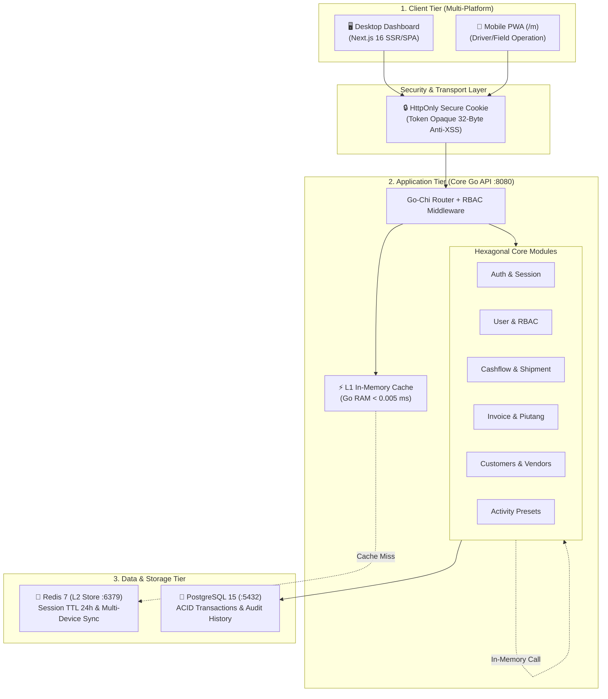
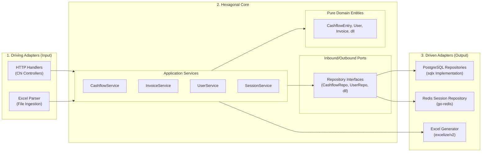
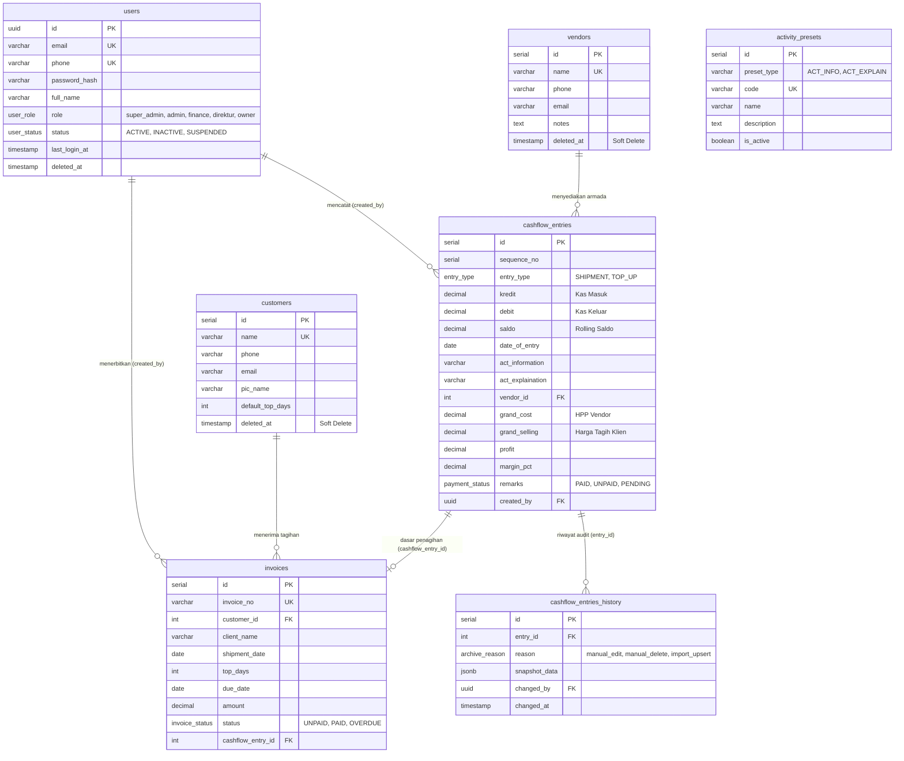

# Dokumentasi Arsitektur Teknis Sistem
## PT. Adijayantara Logistics Indonesia — Cashflow, Shipment & Invoice Control System

Dokumen ini menyajikan panduan arsitektur teknis menyeluruh (*comprehensive technical architecture*) untuk sistem aplikasi **PT. Adijayantara Logistics Indonesia**. Dokumen ini disusun dengan standar rekayasa perangkat lunak enterprise agar mudah dipahami oleh *engineer*, *system administrator*, *product owner*, maupun *auditor teknis*.

---

## Daftar Isi
1. [Ringkasan Eksekutif & Karakteristik Arsitektur](#1-ringkasan-eksekutif--karakteristik-arsitektur)
2. [Topologi Sistem Tingkat Tinggi (High-Level Architecture)](#2-topologi-sistem-tingkat-tinggi-high-level-architecture)
3. [Pola Desain Backend: Hexagonal Architecture (Ports & Adapters)](#3-pola-desain-backend-hexagonal-architecture-ports--adapters)
4. [Struktur Repositori Monorepo (Codebase Layout)](#4-struktur-repositori-monorepo-codebase-layout)
5. [Domain & Modul Bisnis Aplikasi](#5-domain--modul-bisnis-aplikasi)
6. [Arsitektur Keamanan: Two-Tier Session & RBAC](#6-arsitektur-keamanan-two-tier-session--rbac)
7. [Skema Basis Data & Relasi Entitas (Database ERD)](#7-skema-basis-data--relasi-entitas-database-erd)
8. [Katalog REST API & Standar Komunikasi](#8-katalog-rest-api--standar-komunikasi)
9. [Panduan Operasional, Build & Deployment (DevOps)](#9-panduan-operasional-build--deployment-devops)
10. [Strategi Skalabilitas & Roadmap Masa Depan](#10-strategi-skalabilitas--roadmap-masa-depan)

---

## 1. Ringkasan Eksekutif & Karakteristik Arsitektur

### 1.1 Klasifikasi Arsitektur
Sistem aplikasi ini diklasifikasikan sebagai:
> **MODULAR MONOLITH (berpola Hexagonal Architecture / Clean Architecture)** di dalam struktur repositori **MONOREPO**, dan **BUKAN Microservices**.

### 1.2 Mengapa Modular Monolith, Bukan Microservices?
- **Single Execution Process**: Seluruh modul backend dikompilasi menjadi satu file *binary Go* tunggal ([`cmd/api/main.go`](file:///home/aliube/Workspace/Adi/cashflow-shipment-app/services/core-go/cmd/api/main.go)) yang berjalan pada port `8080`.
- **Single Shared Relational Database**: Seluruh modul berbagi satu database PostgreSQL (`cashflow_db`) dengan integritas transaksi ACID penuh (tidak ada kerumitan *distributed transactions* / *two-phase commit*).
- **Zero Network Latency antar Modul**: Komunikasi antar domain bisnis (misal Cashflow dengan Vendor atau Invoice) berjalan *in-memory* melalui fungsi Go asli, bukan melalui panggilan jaringan HTTP/gRPC.
- **Biaya Operasional Rendah & Performa Maksimal**: Sangat ringan dan efisien; satu server VM standar mampu memproses puluhan ribu transaksi per detik dengan konsumsi RAM yang sangat minim.

---

## 2. Topologi Sistem Tingkat Tinggi (High-Level Architecture)

Arsitektur aplikasi terbagi menjadi 3 tingkatan utama (*Three-Tier Architecture*):



---

## 3. Pola Desain Backend: Hexagonal Architecture (Ports & Adapters)

Backend Go dibangun menggunakan prinsip **Inversion of Control (IoC)** dan **Dependency Inversion Principle (DIP)** agar logika bisnis murni (*business rules*) tidak tercampur dengan urusan teknis seperti SQL, HTTP handler, atau format file.



### Penjelasan Lapisan:
1. **`internal/core/domain/`**:
   - Struktur data murni (*pure Go struct*) tanpa ketergantungan pada library SQL maupun JSON.
   - Contoh: [`CashflowEntry`](file:///home/aliube/Workspace/Adi/cashflow-shipment-app/services/core-go/internal/core/domain/cashflow.go), [`Invoice`](file:///home/aliube/Workspace/Adi/cashflow-shipment-app/services/core-go/internal/core/domain/invoice.go), [`User`](file:///home/aliube/Workspace/Adi/cashflow-shipment-app/services/core-go/internal/core/domain/user.go).
2. **`internal/core/ports/`**:
   - Berisi kontrak *interface* yang menentukan apa yang dibutuhkan oleh *service* dari lapisan luar.
   - Menghilangkan kopling (*decoupling*): *Service* tidak peduli apakah data disimpan di PostgreSQL, MySQL, atau Mock Test.
3. **`internal/application/services/`**:
   - Tempat seluruh logika bisnis, validasi aturan bisnis, kalkulasi rolling balance, sinkronisasi sesi, dan auditing dijalankan.
4. **`internal/adapters/`**:
   - **Driving (Input)**: Menerima request luar dan meneruskannya ke service (`adapters/handler/`).
   - **Driven (Output)**: Mengimplementasikan interface port ke database atau teknologi eksternal (`adapters/repository/`).

---

## 4. Struktur Repositori Monorepo (Codebase Layout)

```
cashflow-shipment-app/
├── apps/
│   └── web-next/                   # Frontend Next.js 16 (Turbopack + Tailwind CSS)
│       ├── src/
│       │   ├── app/                # App Router (Desktop /dashboard & Mobile /m)
│       │   │   ├── page.tsx        # Halaman Login & Signup Redesigned
│       │   │   ├── dashboard/      # Desktop Enterprise Dashboard Modules
│       │   │   └── m/              # Mobile PWA Optimized Pages
│       │   ├── components/         # Reusable UI & Modal Components
│       │   ├── hooks/              # useAuth, useDebounce, etc.
│       │   └── lib/                # apiClient (credentials: "include")
├── services/
│   └── core-go/                    # Backend Golang API Service
│       ├── cmd/api/main.go         # Application Entrypoint & Dependency Wiring
│       ├── internal/
│       │   ├── core/domain/        # Pure Business Entities
│       │   ├── core/ports/         # Inbound/Outbound Interface Contracts
│       │   ├── application/        # Business Logic Use-Cases
│       │   ├── adapters/handler/   # HTTP Controllers & REST Endpoints
│       │   ├── adapters/repository/# PostgreSQL & Redis DB Implementation
│       │   └── middleware/         # Two-Tier Auth & Role RBAC Middleware
│       ├── migrations/             # SQL Schema Versioning (000001 s/d 000007)
│       └── pkg/                    # Utilities (bcrypt hash, response standard)
├── docs/                           # Dokumentasi Teknis & Proses Bisnis
├── docker-compose.yml              # Podman/Docker Services (Postgres 15 & Redis 7)
├── Makefile                        # Automation Commands
└── README.md                       # Quickstart Guide
```

---

## 5. Domain & Modul Bisnis Aplikasi

### 5.1 Modul Cashflow & Shipment Control
- **Rolling Saldo Otomatis**: Setiap transaksi pengiriman (Debit/Kredit) mempengaruhi saldo berjalan secara berantai (*cascade recalculation*).
  $$\text{Saldo}_n = \text{Saldo}_{n-1} + \text{Kredit}_n - \text{Debit}_n$$
- **Deteksi Top-Up Otomatis**: Saat import data dari Excel lama, sistem membandingkan saldo baris sebelumnya untuk mendeteksi penambahan modal segar (*fresh top-up*).
- **Kalkulasi Profit & Margin**:
  $$\text{Profit} = \text{Grand Selling} - \text{Grand Cost}$$
  $$\text{Margin } \% = \left( \frac{\text{Profit}}{\text{Grand Selling}} \right) \times 100\%$$
- **Audit Trail & Snapshot History**: Setiap perubahan atau penghapusan data transaksi secara otomatis mencatat salinan historis ke tabel `cashflow_entries_history`.

### 5.2 Modul Invoice & Piutang Monitoring
- **Penerbitan Invoice**: Mencatat nomor invoice unik, nama klien, tanggal shipment, nilai tagihan, dan syarat pembayaran (*Terms of Payment* / TOP).
- **Kalkulasi Jatuh Tempo Otomatis**:
  $$\text{Due Date} = \text{Shipment Date} + \text{TOP Days}$$
- **Status Tagihan**: `UNPAID` (Belum Bayar), `PAID` (Lunas), dan `OVERDUE` (Melewati Jatuh Tempo).

### 5.3 Modul Master Rekanan
- **Klien / Perusahaan (`customers`)**: Menyimpan data relasi klien bisnis dengan NPWP, PIC, plafon kredit, dan termin default.
- **Mitra Armada / Transporter (`vendors`)**: Pengelolaan data pemilik truk dan vendor logistik dengan dukungan *soft-delete* (`deleted_at`).

### 5.4 Modul Preset Aktivitas
- **Keterangan Aktivitas Armada (`activity_presets` tipe `ACT_INFO`)**: Standardisasi penamaan jenis armada (misal: "TRUCK TRONTON WINGBOX", "FUSO BOX").
- **Catatan & Rute Pengiriman (`activity_presets` tipe `ACT_EXPLAIN`)**: Standardisasi rute perjalanan dan catatan ekspedisi (misal: "JKT - SBY PP", "DO PENDING").

---

## 6. Arsitektur Keamanan: Two-Tier Session & RBAC

Sistem menggunakan arsitektur autentikasi enterprise **Opaque Session via HttpOnly Cookie** yang menggantikan JWT tradisional di `localStorage` demi keamanan mutlak dari serangan **Cross-Site Scripting (XSS)**.

```mermaid
sequenceDiagram
    autonumber
    actor User as Pengguna (Browser)
    participant Core as Backend Go (:8080)
    participant L1 as L1 In-Memory RAM
    participant L2 as L2 Redis 7 (:6379)
    participant DB as PostgreSQL (:5432)

    User->>Core: POST /api/v1/auth/login (Email/Phone + Password)
    Core->>DB: Query User & Verifikasi Bcrypt Hash
    DB-->>Core: User Valid (Status: ACTIVE, Role: admin)
    Core->>L2: Simpan Sesi (SETEX session:token 86400)
    Core->>L1: Simpan Sesi Lokal (sync.RWMutex TTL 60s)
    Core-->>User: Set-Cookie: auth_session=sess_... (HttpOnly; SameSite=Lax)

    Note over User,Core: Request Berikutnya (Cth: GET /api/v1/cashflow)
    User->>Core: Request + Cookie Otomatis
    Core->>L1: Cek Sesi di L1 Memory
    alt Cache Hit di L1 (< 0.005 ms)
        L1-->>Core: Session Data Ditemukan
    else Cache Miss di L1
        Core->>L2: Cek Sesi di Redis 7
        L2-->>Core: Session Data Ditemukan
        Core->>L1: Simpan kembali ke L1
    end
    Core-->>User: 200 OK + Data Transaksi
```

### 6.1 Matriks Peran & Hak Akses (RBAC)

| Peran (Role) | Otoritas & Tanggung Jawab | Akses Fitur Utama |
| :--- | :--- | :--- |
| **`super_admin`** *(Rahasia IT)* | Pemeliharaan sistem root, konfigurasi server, pemulihan darurat | **Akses Penuh**: Disembunyikan dari daftar user bisnis, proteksi anti-delete |
| **`admin`** *(Admin Bisnis)* | Pimpinan operasional, manajer keuangan utama | **Akses Penuh Bisnis**: Mengelola user bisnis, edit/hapus transaksi, audit invoice |
| **`finance`** *(Keuangan)* | Staf administrasi kasir & akuntansi | **Input & Edit**: Input cashflow, buat invoice, update pelunasan. *Tidak dapat menghapus transaksi* |
| **`direktur`** *(Direksi)* | Pemantauan kinerja dan audit laporan | **Read-Only Pengawasan**: Melihat seluruh grafik, margin, saldo, dan cetak invoice |
| **`owner`** *(Pemilik Modal)* | Investor / Pemilik Usaha | **Read-Only Finansial**: Memantau laba bersih, kas masuk/keluar, dan aset perusahaan |

### 6.2 Alur Pendaftaran Mandiri & Approval Administrator
1. Pengguna mendaftar melalui form **Sign Up** di halaman muka.
2. Akun otomatis tersimpan dengan status `INACTIVE` dan role default `finance`.
3. Jika pengguna mencoba login sebelum disetujui, sistem memblokir dengan pesan:
   > *"Akun Anda sedang menunggu persetujuan dan aktivasi dari Administrator."*
4. Di dashboard `/dashboard/users`, Administrator melihat badge peringatan **"Menunggu Approval"** dan dapat mengaktivasi serta menetapkan peran definitif dalam satu klik.
5. **Instant Force Logout**: Jika user dinonaktifkan atau password direset, seluruh sesi aktif di Redis dan L1 langsung dicabut secara seketika (*real-time revocation*).

---

## 7. Skema Basis Data & Relasi Entitas (Database ERD)



---

## 8. Katalog REST API & Standar Komunikasi

Seluruh respon API mengikuti format JSON standar:
```json
{
  "status": true,
  "message": "Deskripsi hasil operasi",
  "data": { ... },
  "meta": { "page": 1, "limit": 15, "total": 120 }
}
```

### Ringkasan Endpoint Utama:
| HTTP Verb | Endpoint URI | Hak Akses (RBAC) | Keterangan |
| :--- | :--- | :--- | :--- |
| `POST` | `/api/v1/auth/login` | Publik | Otentikasi dan penerbitan HttpOnly Cookie |
| `POST` | `/api/v1/auth/register` | Publik | Registrasi pengguna baru (Status: `INACTIVE`) |
| `POST` | `/api/v1/auth/logout` | Terautentikasi | Pencabutan sesi di L1 & L2 Redis |
| `GET` | `/api/v1/auth/me` | Terautentikasi | Mengambil profil dan sesi pengguna aktif |
| `GET` | `/api/v1/users` | `admin`, `super_admin` | Daftar pengguna dengan filter peran & status |
| `POST` | `/api/v1/users` | `admin`, `super_admin` | Pendaftaran pengguna oleh admin |
| `PUT` | `/api/v1/users/{id}` | `admin`, `super_admin` | Perubahan status/role (Approval akun) |
| `POST` | `/api/v1/users/{id}/reset-password` | `admin`, `super_admin` | Reset password pengguna |
| `GET` | `/api/v1/cashflow` | Semua Peran Aktif | Daftar arus kas dengan paginasi & filter |
| `POST` | `/api/v1/cashflow/shipment`| `admin`, `finance` | Input transaksi pengiriman baru |
| `POST` | `/api/v1/cashflow/top-up` | `admin`, `finance` | Input kas masuk / penambahan modal |
| `DELETE`| `/api/v1/cashflow/{id}` | `admin`, `super_admin` | Penghapusan transaksi (Proteksi Audit) |
| `POST` | `/api/v1/cashflow/import-excel` | `admin`, `finance` | Import batch file Excel logistik |
| `GET` | `/api/v1/cashflow/export-excel` | Semua Peran Aktif | Export buku kas ke spreadsheet XLSX |
| `GET` | `/api/v1/invoices` | Semua Peran Aktif | Daftar invoice, monitoring jatuh tempo |
| `POST` | `/api/v1/invoices` | `admin`, `finance` | Penerbitan invoice baru |
| `PATCH`| `/api/v1/invoices/{id}/status` | `admin`, `finance` | Pembaruan status pelunasan invoice |

---

## 9. Panduan Operasional, Build & Deployment (DevOps)

### 9.1 Prasyarat Sistem
- **Docker** atau **Podman** & `docker-compose` / `podman-compose`
- **Go Compiler** versi 1.22 atau lebih baru
- **Node.js** versi 20+ & `npm`

### 9.2 Perintah Otomasi (Makefile)
Aplikasi menyediakan automasi lengkap melalui file [`Makefile`](file:///home/aliube/Workspace/Adi/cashflow-shipment-app/Makefile):

```bash
# 1. Menjalankan infrastruktur database & cache (PostgreSQL 15 & Redis 7)
make infra-up

# 2. Mematikan container infrastruktur
make infra-down

# 3. Melihat log container
make infra-logs

# 4. Menjalankan Backend Core Go API secara lokal (:8080)
make run-local-core-go

# 5. Menjalankan Frontend Next.js Desktop & Mobile PWA (:3000)
make run-local-web-next
```

### 9.3 Inisialisasi Akun IT Super Admin Otomatis (`.env`)
Saat aplikasi pertama kali dijalankan, sistem secara otomatis membaca variabel lingkungan pada file [`services/core-go/.env`](file:///home/aliube/Workspace/Adi/cashflow-shipment-app/services/core-go/.env) dan membuat akun Super Admin IT pertama jika belum tersedia:

```env
SUPERADMIN_EMAIL=odealidj.go@gmail.com
SUPERADMIN_PASSWORD=password123
SUPERADMIN_NAME=IT Super Admin
SUPERADMIN_PHONE=082111391380
```

---

## 10. Strategi Skalabilitas & Roadmap Masa Depan

### Kapan Perlu Migrasi ke Microservices?
Saat ini, arsitektur **Modular Monolith** mampu menangani hingga **50.000 transaksi harian** dengan kebutuhan infrastruktur minimal (1 server 2 vCPU, 4 GB RAM).

Migrasi ke *Microservices* baru disarankan apabila salah satu kondisi berikut terpenuhi:
1. **Pemisahan Tim Rekayasa (*Organizational Scaling*)**: Tim developer bertambah menjadi lebih dari 20 engineer dengan divisi terpisah khusus Invoice, Tracking, dan Accounting.
2. **Beban Asimetris Ekstrem (*Extreme Asymmetric Load*)**: Modul tracking GPS atau IoT armada menerima jutaan *ping* per menit, sementara modul keuangan hanya ratusan transaksi per hari.

### Kemudahan Dekomposisi (*Microservice-Ready*)
Karena sistem ini sudah mengadopsi **Hexagonal Architecture** dengan isolasi Domain, Ports, dan Services yang ketat:
- Jika modul `Invoice` ingin dipisahkan menjadi *microservice* tersendiri di masa depan, engineer cukup memindahkan folder `domain/invoice.go`, `ports/invoice_repository.go`, dan `services/invoice_service.go` ke repositori baru tanpa perlu mengubah arsitektur modul lainnya.
