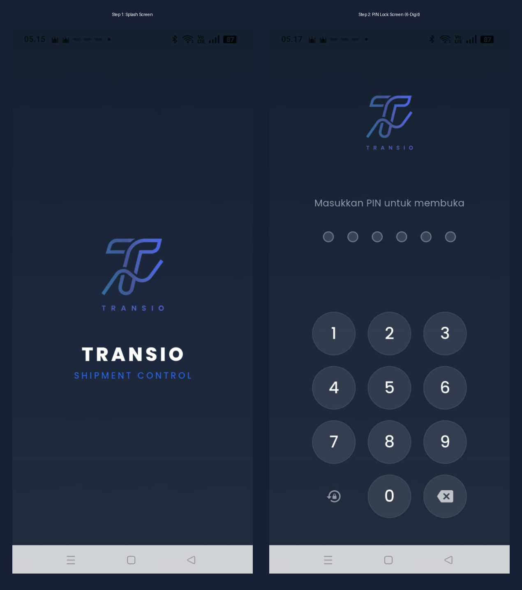

# 02 — Peta Navigasi

> Referensi: Seluruh screenshot di folder `contoh-ui/` dan aset di `assets/`

---

## 2.1 Alur Navigasi Utama

```
┌─────────────────────────────────────────────────────────────────┐
│                        APP LAUNCH                               │
└───────────────────────────┬─────────────────────────────────────┘
                            │
                            ▼
              ┌─────────────────────────┐
              │    Splash Screen (0a)   │  ← Background: #1C2B4A (Dark Blue)
              │    Logo + "TRANSIO"     │  ← Auto-navigate ~2 detik
              │    "SHIPMENT CONTROL"   │
              └────────────┬────────────┘
                           │
                           ▼
              ┌─────────────────────────┐
              │   PIN Lock Screen (0b)  │  ← Background: #1C2B4A (Dark Blue)
              │   6-dot indicator       │  ← Input PIN 6 digit
              │   Numpad 3x4            │  ← Keypad + Reset PIN + Backspace
              └────────────┬────────────┘
                           │ [PIN Benar]
                           ▼
┌──────────────────────────────────────────────────────────────────┐
│                     MAIN APP (Bottom Navigation)                 │
│                                                                  │
│  ┌──────────┬──────────┬────────┬──────────┬───────────────┐   │
│  │ Beranda  │ Laporan  │  [+]   │ Tagihan  │ Pengaturan    │   │
│  │  (Tab1)  │  (Tab2)  │ (FAB)  │  (Tab3)  │   (Tab4)      │   │
│  └──────────┴──────────┴────────┴──────────┴───────────────┘   │
│       │           │        │         │             │             │
│       ▼           ▼        ▼         ▼             ▼             │
│   Beranda     Laporan  Tambah    Tagihan      Pengaturan         │
│   (scroll)   (scroll) Transaksi  (scroll)      (scroll)          │
│                        (push)                                     │
└──────────────────────────────────────────────────────────────────┘
```

---

## 2.2 Preview Visual Alur Awal (Step 1 & Step 2)



---

## 2.3 Bottom Navigation Bar

```
┌─────────────────────────────────────────────────────────────┐
│  [🏠]       [📊]       [  ●  ]      [🔔]       [⚙️]        │
│ Beranda   Laporan     (FAB +)    Tagihan    Pengaturan      │
└─────────────────────────────────────────────────────────────┘
```

| Tab | Ikon | Label | Tipe |
|---|---|---|---|
| 1 | House | **Beranda** | Standard tab (Scrollable Page) |
| 2 | Bar chart / Document | **Laporan** | Standard tab (Scrollable Page) |
| — | Plus (biru besar) | **(FAB +)** | Floating Action Button (Push Screen Form) |
| 3 | Bell / Lonceng | **Tagihan** | Standard tab (Single Page) |
| 4 | Gear / Settings | **Pengaturan** | Standard tab (Scrollable Page) |

**FAB (Floating Action Button):**
- Posisi: Tepat di **tengah** bottom navigation bar
- Ukuran: 56dp × 56dp
- Warna: `primary` biru solid (`#2563EB`), elevated
- Aksi: **Push screen** "Tambah Transaksi" (bukan tab — bottom navigation bar menghilang dan ada back arrow `←` serta tombol simpan `✓` di AppBar gelap)

---

## 2.4 Inventaris Screen & Aset Terkonsolidasi

| ID | Nama Screen | Sumber Mentah (`contoh-ui/`) | Aset Terkonsolidasi (`assets/`) | Sifat Halaman |
|---|---|---|---|---|
| S0a | Splash Screen | `0. screen-awal/1.page-1.png` | [`00-screen-awal.png`](./assets/00-screen-awal.png) | Step 1 (auto-navigate) |
| S0b | PIN Lock Screen | `0. screen-awal/2.page-2.png` | [`00-screen-awal.png`](./assets/00-screen-awal.png) | Step 2 (auth 6-digit) |
| S1 | Beranda | `1.Beranda/Beranda1–4.png` | [`01-beranda-fullpage.png`](./assets/01-beranda-fullpage.png) | **1 Halaman Scroll Utuh** |
| S2 | Laporan | `2.Laporan/Laporan1–2.png` | [`02-laporan-fullpage.png`](./assets/02-laporan-fullpage.png) | **1 Halaman Scroll Utuh** |
| S3 | Tagihan | `3.Tagihan/Tagihan.png` | [`03-tagihan-fullpage.png`](./assets/03-tagihan-fullpage.png) | **1 Halaman Utuh** |
| S4 | Pengaturan | `4.Pengaturan/Pengaturan1–3.png` | [`04-pengaturan-fullpage.png`](./assets/04-pengaturan-fullpage.png) | **1 Halaman Scroll Utuh** |
| S5 | Tambah Transaksi | `5.Tambah-Transaksi/Tambah*.png` | [`05-tambah-transaksi-fullpage.png`](./assets/05-tambah-transaksi-fullpage.png) | **1 Form Push Screen Scroll** |

---

*Lanjut: [03-screen-awal.md](./03-screen-awal.md)*
