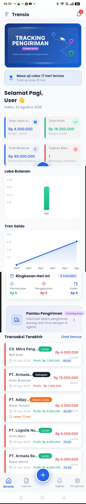

# 04 — Beranda (Dashboard Utama)

> Referensi: `contoh-ui/1.Beranda/Beranda1.png` s/d `Beranda4.png`
> Aset Terkonsolidasi: [`assets/01-beranda-fullpage.png`](./assets/01-beranda-fullpage.png)
> **1 halaman yang dapat di-scroll secara vertikal dari atas sampai bawah.**

---

## 4.1 Preview Visual Halaman Penuh (Full Page Scroll)



---

## 4.2 Urutan Konten (Top → Bottom)

```
┌─────────────────────────────────────────────┐  ← VIEWPORT 1 (Atas)
│  AppBar: [Logo] Transio          [🔔¹]      │
├─────────────────────────────────────────────┤
│  ┌──────────────────────────────────────┐   │
│  │  Hero Banner (Biru Gradien)          │   │
│  │  TRACKING PENGIRIMAN                 │   │
│  │  [Coming Soon]  🚚  📍              │   │
│  │  Pantau status pengiriman real-time  │   │
│  └──────────────────────────────────────┘   │
│  ┌──────────────────────────────────────┐   │
│  │ ⏳ Masa uji coba: 17 hari tersisa   │   │  ← Trial banner
│  │    Total uji coba 30 hari            │   │
│  └──────────────────────────────────────┘   │
│  Selamat Pagi, User 👋                      │  ← Greeting dinamis
│  Sabtu, 22 Agustus 2026                     │  ← Tanggal dinamis
│                                             │
│  ┌──────────────┐   ┌──────────────┐       │  ← KPI Grid 2x2
│  │ Total Saldo  │   │ Total Profit │       │
│  │ Rp 4.500.000 │   │ Rp 16.500.000│       │
│  └──────────────┘   └──────────────┘       │
│  ┌──────────────┐   ┌──────────────┐       │
│  │ Total Revenue│   │ Tagihan Belu.│       │
│  │ Rp 46.000.000│   │ 1 Menunggu  │       │
│  └──────────────┘   └──────────────┘       │
├─────────────────────────────────────────────┤  ← VIEWPORT 2 (Tengah Atas)
│  Laba Bulanan                               │
│  ┌──────────────────────────────────────┐   │
│  │  [Bar Chart Hijau - per bulan]       │   │
│  └──────────────────────────────────────┘   │
│  Tren Saldo                                 │
│  ┌──────────────────────────────────────┐   │
│  │  [Line Chart Biru Area - tren]       │   │
│  └──────────────────────────────────────┘   │
├─────────────────────────────────────────────┤  ← VIEWPORT 3 (Tengah Bawah)
│  ┌──────────────────────────────────────┐   │
│  │ 📅 Ringkasan Hari Ini    0 transaksi │   │
│  │  ↓ Pemasukan  ↑ Pengeluaran  💼 Saldo│   │
│  │  Rp 0         Rp 0           Rp 0    │   │
│  └──────────────────────────────────────┘   │
│  ┌──────────────────────────────────────┐   │
│  │ 🚚 Pantau Pengiriman   [Coming Soon] │   │  ← Feature promo card
│  │    Informasi status pengiriman...  > │   │
│  └──────────────────────────────────────┘   │
├─────────────────────────────────────────────┤  ← VIEWPORT 4 (Bawah)
│  Transaksi Terakhir              Lihat Semua│
│  ┌──────────────────────────────────────┐   │
│  │ ║ CV. Mitra Peng... [Lunas]  Rp 4jt │   │
│  │ ║ Beli Solar  📅 09 Agu  Profit 50% │   │
│  └──────────────────────────────────────┘   │
│  ┌──────────────────────────────────────┐   │
│  │ ║ PT. Armada...   [Sebagian] Rp 15jt│   │
│  └──────────────────────────────────────┘   │
│  ... (5 item transaksi terakhir)            │
│                                             │
│  [🏠]    [📊]      [ + ]      [🔔]     [⚙️]  │  ← Bottom nav
└─────────────────────────────────────────────┘
```

---

## 4.3 Rincian Komponen

### 1. Top AppBar
- Logo Transio kecil + tulisan "Transio" di sebelah kiri
- Ikon lonceng notifikasi di kanan dengan **badge merah berisi angka** (mis. `1`)

### 2. Hero Banner (Tracking Pengiriman)
- Background: Gradien biru tajam (`#1E40AF → #3B5CF6`)
- Teks: "TRACKING PENGIRIMAN" (putih bold) + badge `[COMING SOON]` (ungu pastel)
- Subtitle: "Pantau status pengiriman barang real-time"
- Ilustrasi: Truk pengiriman + pin rute lokasi di kanan

### 3. Trial Banner
- Box putih dengan border tipis dan ikon jam pasir biru
- Teks: "Masa uji coba: **17 hari tersisa**" / "Total uji coba 30 hari"

### 4. Greeting Dinamis
- "Selamat [Pagi/Siang/Sore/Malam], [Nama Pengguna] 👋"
- Tanggal hari ini dalam format Bahasa Indonesia (mis. "Sabtu, 22 Agustus 2026")

### 5. Grid KPI (2×2)
- **Total Saldo Aktif**: Border biru, Rp 4.500.000, Subtext "Kredit - Debit"
- **Total Profit**: Border hijau, Rp 16.500.000, Subtext "Margin positif"
- **Total Revenue**: Border biru, Rp 46.000.000, Subtext "Pemasukan keseluruhan"
- **Tagihan Belum Bayar**: Border merah, 1, Subtext "Menunggu pembayaran"

### 6. Grafik Analitik
- **Laba Bulanan**: Vertical Bar Chart (`fl_chart`), bar warna hijau (`#22C55E`), label sumbu Y (juta) dan sumbu X (nama bulan singkat).
- **Tren Saldo**: Line Chart area fill biru, titik data penanda posisi saldo terkini.

### 7. Ringkasan Hari Ini
- Card kalender berisi 3 kolom ringkasan harian:
  - Pemasukan (hijau ↓)
  - Pengeluaran (merah ↑)
  - Saldo (biru 💼)

### 8. Pantau Pengiriman (Promo Feature)
- Card ungu muda dengan ikon truk dan badge "Coming Soon"

### 9. Transaksi Terakhir
- Header dengan tombol navigasi **"Lihat Semua"**
- List 5 card transaksi terbaru

---

*Lanjut: [05-laporan.md](./05-laporan.md)*
