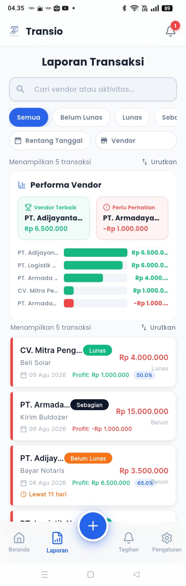

# 05 — Laporan (Transaction Report)

> Referensi: `contoh-ui/2.Laporan/Laporan1.png` dan `Laporan2.png`
> Aset Terkonsolidasi: [`assets/02-laporan-fullpage.png`](./assets/02-laporan-fullpage.png)
> **1 halaman yang dapat di-scroll secara vertikal** (menggabungkan area filter, ringkasan performa vendor, dan list transaksi lengkap).

---

## 5.1 Preview Visual Halaman Penuh (Full Page Scroll)



---

## 5.2 Urutan Konten (Top → Bottom)

```
┌─────────────────────────────────────────────┐
│              Laporan Transaksi              │  ← Page title (centered, bold)
│                                             │
│  ┌──────────────────────────────────────┐   │
│  │ 🔍  Cari vendor atau aktivitas...    │   │  ← Search bar (rounded full)
│  └──────────────────────────────────────┘   │
│                                             │
│  [Semua●] [Belum Lunas○] [Lunas○] [Sebc→]  │  ← Filter chips (horizontal scroll)
│                                             │
│  [📅 Rentang Tanggal]  [🏪 Vendor]          │  ← Advanced filter row
│                                             │
│  Menampilkan 5 transaksi     ↕ Urutkan      │  ← Result count + sort
│                                             │
│  ┌──────────────────────────────────────┐   │
│  │ 📊 Performa Vendor                   │   │
│  │  ┌──────────────┐ ┌──────────────┐   │   │
│  │  │🏆 Vendor     │ │⚠️ Perlu       │   │   │
│  │  │   Terbaik    │ │  Perhatian   │   │   │
│  │  │PT.Adijay...  │ │PT.Armada...  │   │   │
│  │  │Rp 6.500.000  │ │-Rp 1.000.000│   │   │
│  │  └──────────────┘ └──────────────┘   │   │
│  │  PT.Adijayan... ████████████  6.5jt  │   │
│  │  PT.Logistik .. ██████████    6.0jt  │   │
│  │  PT.Armada  ... █████         4.0jt  │   │
│  │  CV.Mitra Pe... █             1.0jt  │   │
│  │  PT.Armada  ... ▌            -1.0jt  │   │  ← bar merah = rugi/minus
│  └──────────────────────────────────────┘   │
│                                             │
│  ┌─ Daftar Card Transaksi ───────────────┐  │
│  │ ║ CV. Mitra Peng...  [Lunas]  Rp 4jt │  │
│  │ ║ Beli Solar                          │  │
│  │ ║ 📅 09 Agu 2026  Profit: Rp 1jt 50%│  │
│  └─────────────────────────────────────────┘  │
│  ┌─────────────────────────────────────────┐  │
│  │ ║ PT. Armada...   [Sebagian]  Rp 15jt  │  │
│  └─────────────────────────────────────────┘  │
│  ┌─────────────────────────────────────────┐  │
│  │ ║ PT. Adijay...   [Belum Lunas]Rp 3.5jt│  │
│  │ ║ ⏰ Lewat 11 hari                      │  │
│  └─────────────────────────────────────────┘  │
│  ... (seluruh item transaksi berikutnya)    │
│                                             │
│  [🏠]    [📊●]     [ + ]      [🔔]     [⚙️]  │  ← Bottom nav (Tab 2 aktif)
└─────────────────────────────────────────────┘
```

---

## 5.3 Rincian Fitur & Komponen

### 1. Header & Pencarian
- **Judul**: "Laporan Transaksi" (bold, centered, font 24sp)
- **Search Bar**: Input pencarian real-time ("Cari vendor atau aktivitas...") dengan rounded pill

### 2. Baris Filter Fleksibel
- **Status Chips (Scrollable Horizontal)**: `Semua` | `Belum Lunas` | `Lunas` | `Sebagian`
- **Filter Lanjutan**:
  - `📅 Rentang Tanggal` (Date Range Picker)
  - `🏪 Vendor` (Dropdown / Bottom Sheet Picker Vendor)
- **Urutan & Info Jumlah**: Menampilkan jumlah item ("Menampilkan 5 transaksi") dan tombol `↕ Urutkan`

### 3. Card Performa Vendor
- **Dua Kotak Sorotan (Highlight)**:
  - 🏆 **Vendor Terbaik**: Background hijau muda (`#F0FDF4`), nama vendor + nilai profit positif tertinggi
  - ⚠️ **Perlu Perhatian**: Background merah muda (`#FEF2F2`), nama vendor + nilai profit minus/terendah
- **Grafik Batang Horizontal**: Visualisasi perbandingan profit per vendor (bar hijau = positif, bar merah = negatif)

### 4. Card Transaksi
- **Aksen Strip Kiri**: Strip merah 4px di sisi kiri card
- **Badge Status**: `Lunas` (hijau), `Sebagian` (abu gelap), `Belum Lunas` (oranye)
- **Informasi Overdue**: "⏰ Lewat X hari" warna oranye/merah jika melewati jatuh tempo

---

*Lanjut: [06-tambah-transaksi.md](./06-tambah-transaksi.md)*
