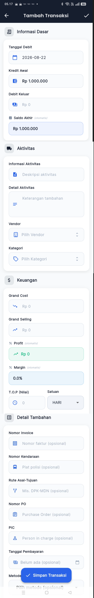

# 06 — Tambah Transaksi (Form FAB)

> Referensi: `contoh-ui/5.Tambah-Transaksi/` (4 potongan seksi)
> Aset Terkonsolidasi: [`assets/05-tambah-transaksi-fullpage.png`](./assets/05-tambah-transaksi-fullpage.png)
> **1 halaman form panjang scrollable dengan 4 seksi terstruktur.**
> Dibuka saat user menekan tombol **FAB [+]** di tengah bottom navigation bar.

---

## 6.1 Preview Visual Form Penuh (Full Page Scroll)



---

## 6.2 Karakteristik Halaman & AppBar

```
┌──────────────────────────────────────────────┐
│  ←  Tambah Transaksi                      ✓  │  ← Background: #1C2B4A (Dark Blue)
└──────────────────────────────────────────────┘
```

- **Tipe Layar**: Push Screen (Bottom Navigation Bar disembunyikan)
- **AppBar Dark (`#1C2B4A`)**:
  - Tombol Kiri: `←` (Kembali / Batal)
  - Judul: "Tambah Transaksi" (Putih bold)
  - Tombol Kanan: `✓` (Shortcut Simpan Transaksi)
- **Floating Sticky Button**:
  - Tombol biru solid `[✓ Simpan Transaksi]` mengambang sticky di bagian bawah layar (tetap tampak saat form di-scroll)

---

## 6.3 Struktur 4 Seksi Form

```
┌──────────────────────────────────────────────┐
│  📋 Seksi 1: Informasi Dasar                 │
│  - Tanggal Debit [📅 2026-08-22]             │
│  - Kredit Awal [💳 Rp 1.000.000]             │
│  - Debit Keluar [💵 Rp 0]                    │
│  - Saldo Akhir (otomatis) [Rp 1.000.000] (🔵)│
├──────────────────────────────────────────────┤
│  🚚 Seksi 2: Aktivitas                       │
│  - Informasi Aktivitas [📄 Deskripsi...]     │
│  - Detail Aktivitas [≡ Keterangan tambahan]  │
│  - Vendor [🏢 Pilih Vendor ⇅]                │
│  - Kategori [🏷️ Pilih Kategori ⇅]             │
├──────────────────────────────────────────────┤
│  $ Seksi 3: Keuangan                         │
│  - Grand Cost [📉 Rp 0]                      │
│  - Grand Selling [📈 Rp 0]                   │
│  - % Profit (otomatis) [📈 Rp 0] (🟢)         │
│  - % Margin (otomatis) [0.0%] (🔵)           │
│  - T.O.P (Nilai) [🕐 0]  Satuan [HARI ▼]     │
│  - Due Date (otomatis) [📅 - ✏️] (🟠)         │
│  - Status Pembayaran [🕐 Belum Lunas ▼]      │
├──────────────────────────────────────────────┤
│  📋 Seksi 4: Detail Tambahan (Semua Opsional)│
│  - Nomor Invoice [🧾 No faktur]              │
│  - Nomor Kendaraan [🚌 Plat polisi]          │
│  - Rute Asal-Tujuan [⑂ Mis. DPK-MDN]         │
│  - Nomor PO [📋 Purchase Order]              │
│  - PIC [👤 Person in charge]                 │
│  - Tanggal Pembayaran [💳 Belum ada 📅]      │
│  - Metode Pembayaran [Pilih metode ▼]        │
├──────────────────────────────────────────────┤
│     [  ✓  Simpan Transaksi  ] (Sticky)       │
└──────────────────────────────────────────────┘
```

---

## 6.4 Formula Auto-Calculate & Warna Indikator

| Field Otomatis | Formula Kalkulasi | Warna Background Field |
|---|---|---|
| **Saldo Akhir** | `Kredit Awal − Debit Keluar` | Biru Muda (`#EFF6FF`) |
| **Profit** | `Grand Selling − Grand Cost` | Hijau Muda (`#F0FDF4`) |
| **Margin %** | `(Profit / Grand Cost) × 100` | Biru Muda (`#EFF6FF`) |
| **Due Date** | `Tanggal Debit + T.O.P (Nilai + Satuan)` | Oranye Muda (`#FFF7ED`) *(dapat di-tap untuk override)* |

---

*Lanjut: [07-tagihan.md](./07-tagihan.md)*
