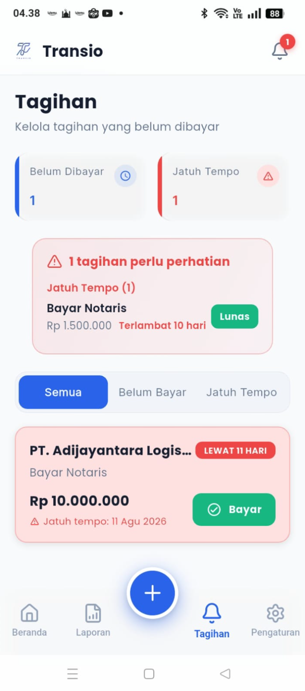

# 07 — Tagihan (Bills & Invoice Management)

> Referensi: `contoh-ui/3.Tagihan/Tagihan.png`
> Aset Terkonsolidasi: [`assets/03-tagihan-fullpage.png`](./assets/03-tagihan-fullpage.png)
> **1 halaman utuh pengelolaan tagihan belum bayar & jatuh tempo.**

---

## 7.1 Preview Visual Halaman Penuh



---

## 7.2 Rincian Komponen & Alur Interaksi

```
┌─────────────────────────────────────────────┐
│  Tagihan                                    │  ← Judul Halaman
│  Kelola tagihan yang belum dibayar          │  ← Subtitle
│                                             │
│  ┌────────────────┐  ┌──────────────────┐  │
│  │ 🕐 Belum Dibayar│  │ ⚠️ Jatuh Tempo   │  │  ← Ringkasan 2 Kolom
│  │       1        │  │        1         │  │
│  └────────────────┘  └──────────────────┘  │
│                                             │
│  ┌──────────────────────────────────────┐   │
│  │ ⚠️ 1 tagihan perlu perhatian         │   │  ← Alert Banner Jatuh Tempo
│  │   Jatuh Tempo (1)                   │   │
│  │   Bayar Notaris                     │   │
│  │   Rp 1.500.000    Terlambat 10 hari │   │
│  │                           [Lunas]   │   │
│  └──────────────────────────────────────┘   │
│                                             │
│  [Semua●]  [Belum Bayar○]  [Jatuh Tempo○]  │  ← Tab Filter 3 Mode
│                                             │
│  ┌──────────────────────────────────────┐   │
│  │  PT. Adijayantara Logis...           │   │  ← Card Overdue (Background Merah Muda)
│  │  [LEWAT 11 HARI]                    │   │
│  │  Bayar Notaris                       │   │
│  │  Rp 10.000.000            [✓ Bayar]│   │  ← Tombol Aksi Cepat "Bayar" (Hijau)
│  │  ⚠️ Jatuh tempo: 11 Agu 2026        │   │
│  └──────────────────────────────────────┘   │
│                                             │
│  [🏠]    [📊]      [ + ]      [🔔●]    [⚙️]  │  ← Tab 3 aktif (Ikon Lonceng/Tagihan)
└─────────────────────────────────────────────┘
```

### Tombol Cepat "Bayar" (`Quick Pay`)
- Tombol hijau pill `[✓ Bayar]` pada card tagihan memungkinkan pengguna mencatat pelunasan dengan 1 ketukan (`PATCH /api/cashflow/:id` dengan status `PAID`).

---

*Lanjut: [08-pengaturan.md](./08-pengaturan.md)*
