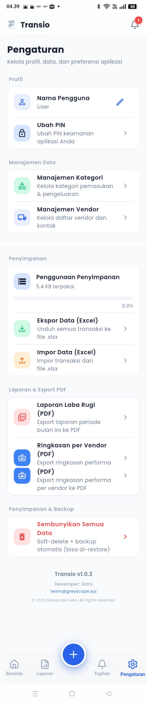

# 08 — Pengaturan (Settings)

> Referensi: `contoh-ui/4.Pengaturan/Pengaturan1.png` s/d `Pengaturan3.png`
> Aset Terkonsolidasi: [`assets/04-pengaturan-fullpage.png`](./assets/04-pengaturan-fullpage.png)
> **1 halaman scrollable utuh dari Profil sampai Footer Informasi Aplikasi.**

---

## 8.1 Preview Visual Halaman Penuh (Full Page Scroll)



---

## 8.2 Struktur Menu & Grup Pengaturan

```
┌─────────────────────────────────────────────┐
│  Pengaturan                                 │  ← Judul Halaman
│  Kelola profil, data, dan preferensi        │  ← Subtitle
│                                             │
│  Profil                                     │  ← GRUP 1
│  ┌──────────────────────────────────────┐   │
│  │ [👤] Nama Pengguna        User   ✏️  │   │  (Inline edit nama)
│  ├──────────────────────────────────────┤   │
│  │ [🔒] Ubah PIN                      >│   │  (Navigasi ubah PIN)
│  └──────────────────────────────────────┘   │
│                                             │
│  Manajemen Data                             │  ← GRUP 2
│  ┌──────────────────────────────────────┐   │
│  │ [△] Manajemen Kategori             > │   │  (CRUD Kategori)
│  ├──────────────────────────────────────┤   │
│  │ [🚚] Manajemen Vendor              > │   │  (CRUD Vendor & Kontak)
│  └──────────────────────────────────────┘   │
│                                             │
│  Penyimpanan                                │  ← GRUP 3
│  ┌──────────────────────────────────────┐   │
│  │ [≡] Penggunaan Penyimpanan           │   │  (Info KB + Progress Bar 0.0%)
│  ├──────────────────────────────────────┤   │
│  │ [↓] Ekspor Data (Excel)            > │   │  (Download file .xlsx)
│  ├──────────────────────────────────────┤   │
│  │ [↑] Impor Data (Excel)             > │   │  (Upload file .xlsx)
│  └──────────────────────────────────────┘   │
│                                             │
│  Laporan & Export PDF                       │  ← GRUP 4
│  ┌──────────────────────────────────────┐   │
│  │ [PDF] Laporan Laba Rugi (PDF)      > │   │  (Generate & download PDF)
│  ├──────────────────────────────────────┤   │
│  │ [📁] Ringkasan per Vendor (PDF)    > │   │  (Generate & download PDF)
│  └──────────────────────────────────────┘   │
│                                             │
│  Penyimpanan & Backup                       │  ← GRUP 5
│  ┌──────────────────────────────────────┐   │
│  │ [🗑️] Sembunyikan Semua Data        > │   │  (Soft-delete + auto-backup)
│  │       (Teks Merah / Destructive)     │   │   [Wajib Dialog Konfirmasi]
│  └──────────────────────────────────────┘   │
│                                             │
│           Transio v1.0.3                    │  ← FOOTER INFORMASI
│          Developer: Gani                    │
│       team@greyscope.xyz                    │
│  © 2026 Greyscope Labs. All rights reserved │
│                                             │
│  [🏠]    [📊]      [ + ]      [🔔]     [⚙️●] │  ← Tab 4 aktif (Pengaturan)
└─────────────────────────────────────────────┘
```

---

*Lanjut: [09-fitur-dan-backend-mapping.md](./09-fitur-dan-backend-mapping.md)*
