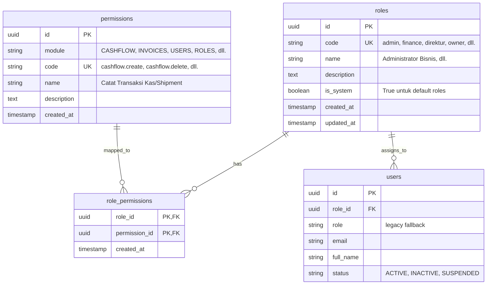
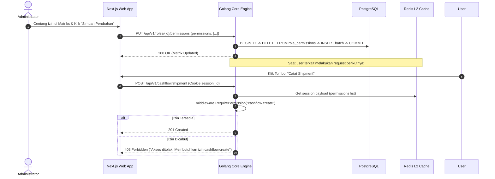

# Spesifikasi Teknis: Dynamic RBAC & PBAC (Permission-Based Access Control)

**PT. Adijayantara Logistics Indonesia**  
*Versi Arsitektur: 2.1 (Dynamic Roles & Granular Action Matrix)*  
*Tanggal: 3 September 2026*

---

## 1. Latar Belakang & Filosofi Desain

Sebelumnya, otorisasi sistem bersifat *hardcoded* berbasis nama peran (`super_admin`, `admin`, `finance`, dll.). Dalam operasional logistik yang dinamis, manajemen menginginkan fleksibilitas penuh:
1. **Dinamika Tombol & Fitur**: Setiap tombol (Tambah Shipment, Top Up Modal, Edit Transaksi, Hapus, Export, Import, Cetak Kwitansi, dll.) dapat di-*assign* atau dicabut hak aksesnya per peran secara visual melalui dashboard.
2. **Peran Kustom**: Perusahaan dapat menambahkan peran jabatan baru (misal: *Supervisor Lapangan*, *Auditor Eksternal*) tanpa merubah kode program.
3. **Fail-Safe Single Root Super Admin**: Hanya akun `super_admin` (IT Root) yang memiliki proteksi bypass mutlak (`*`), tidak bisa dihapus atau dicabut izinnya, memastikan sistem tidak pernah terkunci (*anti-lockout*).
4. **Wewenang C-Level (Owner & Direktur) vs Admin**: Direktur dan Pemilik Perusahaan (Owner) memiliki wewenang hirarki di atas Administrator Bisnis, termasuk hak untuk menonaktifkan atau mengganti staf Admin.

---

## 2. Struktur Database Relasional (Migration `000008`)

Sistem menerapkan arsitektur PBAC (*Permission-Based Access Control*) relasional:

---

## 3. Matriks 25 Izin Sistem (Permission Codes)

| Modul | Kode Izin | Nama Aksi / Tombol | Deskripsi |
| :--- | :--- | :--- | :--- |
| **CASHFLOW** | `cashflow.view` | Menu & Halaman Kas Operasional | Menampilkan menu Kas di sidebar dan mengizinkan membuka tabel kas & pengiriman |
| | `cashflow.create` | Catat Shipment & Top Up Modal | Akses tombol *Catat Shipment* & *Tambah Modal* |
| | `cashflow.edit` | Edit Transaksi Kas | Akses tombol aksi *Edit* baris transaksi |
| | `cashflow.delete` | Hapus Transaksi Kas | Akses tombol aksi *Hapus* baris transaksi |
| | `cashflow.export` | Ekspor Excel & Laporan | Akses tombol *Ekspor Excel* & *Cetak Laporan* |
| | `cashflow.import` | Impor Excel Batch | Akses tombol *Impor Excel* |
| **INVOICES** | `invoices.view` | Menu & Halaman Invoice Piutang | Menampilkan menu Invoice di sidebar dan mengizinkan membuka monitoring tagihan |
| | `invoices.create` | Buat Invoice Baru | Akses tombol *Buat Invoice Baru* |
| | `invoices.edit` | Edit Invoice | Akses tombol aksi *Edit* invoice |
| | `invoices.delete` | Hapus Invoice | Akses tombol aksi *Hapus* invoice (soft delete) |
| | `invoices.mark_paid` | Pelunasan Invoice | Akses mengubah status lunas / bayar |
| | `invoices.print` | Cetak Kwitansi & Rekap | Akses cetak surat jalan / kwitansi tagihan |
| **CUSTOMERS**| `customers.view` | Menu & Master Klien (Customer) | Menampilkan menu Klien di sidebar dan membaca daftar perusahaan customer |
| | `customers.manage` | Kelola Klien | Tambah, edit, dan hapus master customer |
| **VENDORS** | `vendors.view` | Menu & Master Mitra Vendor | Menampilkan menu Mitra Armada di sidebar dan membaca daftar transporter/vendor |
| | `vendors.manage` | Kelola Mitra Vendor | Tambah, edit, dan hapus master vendor armada |
| **PRESETS** | `presets.view` | Menu & Master Preset Aktivitas | Menampilkan menu Preset di sidebar dan membaca master rute & keterangan armada |
| | `presets.manage` | Kelola Preset Aktivitas | Tambah, edit, dan hapus master preset aktivitas |
| **USERS** | `users.view` | Menu & Manajemen Pengguna | Menampilkan menu Manajemen Pengguna di sidebar dan melihat daftar akun staf |
| | `users.create` | Tambah Akun Pengguna | Akses mendaftarkan pengguna baru |
| | `users.edit` | Edit Pengguna & Peran | Akses mengubah profil dan peran pengguna |
| | `users.delete` | Hapus / Nonaktifkan Akun | Akses tombol *Nonaktifkan / Hapus* pengguna |
| | `users.reset_password` | Reset Password Pengguna | Akses tombol *Reset Password* akun pengguna |
| **ROLES** | `roles.view` | Menu & Peran Hak Akses (PBAC) | Menampilkan menu Peran & Hak Akses di sidebar dan melihat matriks perizinan |
| | `roles.manage` | Kelola Peran & Matriks | Tambah peran baru, simpan checklist izin |

---

## 4. Tiga Aturan Emas Tata Kelola Pengguna (*Golden Rules*)

Untuk mencegah kebuntuan operasional (*deadlock*) dan menjaga hirarki manajerial, Backend dan Frontend menerapkan validasi ketat:

### Aturan 1: Anti Self-Deletion (Dilarang Menghapus Diri Sendiri)
> Pengguna yang sedang login **dilarang keras** menghapus atau menonaktifkan akunnya sendiri.
> - **Backend**: Memvalidasi `currentUserID == targetUserID` dan menolak request dengan status HTTP 400.
> - **Frontend**: Tombol hapus pada baris akun sendiri dinonaktifkan (*disabled*) dengan tooltip peringatan.

### Aturan 2: Last Admin Standing (Admin Terakhir Dilindungi)
> Sistem **memblokir penonaktifan atau penghapusan akun Admin** jika pengguna tersebut adalah satu-satunya Administrator aktif yang tersisa di perusahaan.
> - **Backend**: Menghitung `CountActiveUsersByRoleCode("admin")`. Jika `count <= 1`, operasi ditolak dengan pesan: *"Tidak dapat menonaktifkan atau menghapus akun Administrator terakhir untuk kelangsungan sistem"*.
> - **Frontend**: Mengunci tombol hapus pada baris admin terakhir secara real-time.

### Aturan 3: C-Level Immunity (Kekebalan Direktur & Pemilik Modal)
> Administrator Bisnis biasa **tidak memiliki wewenang** untuk mengubah, mereset password, menonaktifkan, atau menghapus akun `direktur` maupun `owner`. Sebaliknya, `owner` dan `direktur` memiliki wewenang penuh untuk menonaktifkan staf ber-role `admin`.

---

## 5. Alur Sinkronisasi Sesi Real-Time (Two-Tier Session)

---

## 6. Integrasi Frontend Next.js

1. **Custom Hook `useAuth()`**:
   - `can(permissionCode: string): boolean`: Mengecek izin secara reaktif. Jika role `super_admin` atau ada wildcard `*`, otomatis mengembalikan `true`.
   - `canAny(permissionCodes: string[]): boolean`: Memeriksa apakah minimal satu izin terpenuhi.
   - `canManageUser(targetRole, targetUserId)`: Mengembalikan `{ allowed: boolean, reason?: string }` sesuai 3 Aturan Emas.
2. **Page `/dashboard/roles`**:
   - Menampilkan kartu daftar peran di sebelah kiri.
   - Menampilkan matriks checklist izin modular di sebelah kanan dengan header tema seragam `bg-[#EBF3FA]`.
   - Mendukung penciptaan peran kustom dan pembaruan izin instan.
3. **Sidebar Navigation**:
   - Menu *Manajemen Pengguna* tampil jika memiliki izin `users.view`.
   - Menu *Peran & Hak Akses* tampil jika memiliki izin `roles.view`.
