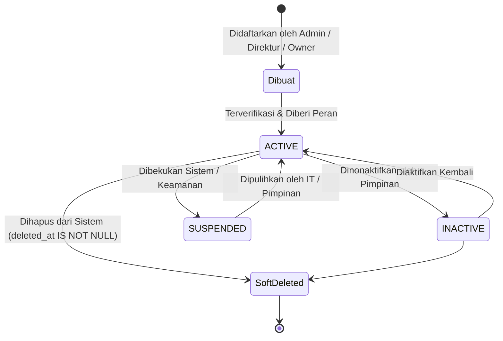
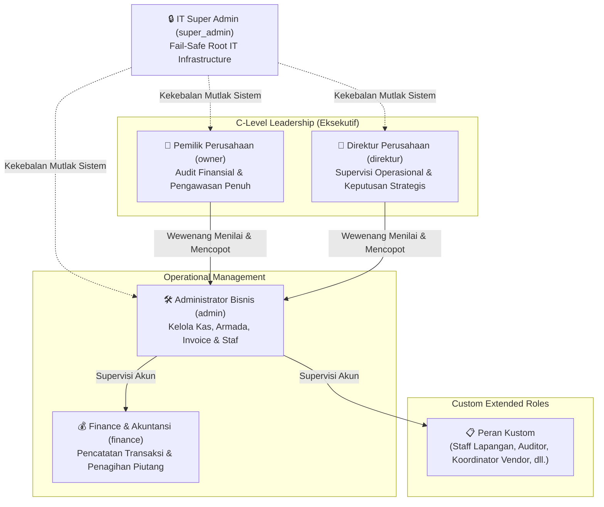
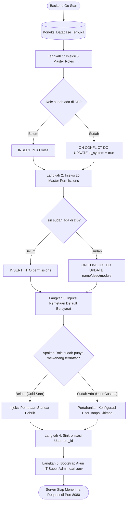
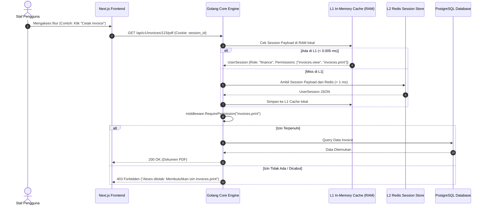

# Panduan Lengkap: Tata Kelola Pengguna, Peran Dinamis (PBAC), Auto-Bootstrap & Aturan Main Sistem

**PT. Adijayantara Logistics Indonesia**  
*Sistem Manajemen Kas, Pengiriman Armada & Monitoring Invoice*  
*Versi Arsitektur: 2.2 (Dynamic PBAC, Zero-Config Injection, & Two-Tier Session)*  
*Dokumen Resmi Rekayasa Perangkat Lunak & Proses Bisnis*  

---

## Daftar Isi

1. [Latar Belakang & Filosofi Tata Kelola Organisasi](#1-latar-belakang--filosofi-tata-kelola-organisasi)
2. [Entitas Pengguna (User) & Siklus Hidup Akun](#2-entitas-pengguna-user--siklus-hidup-akun)
3. [Hirarki Jabatan & 5 Peran Bawaan Sistem (System Default Roles)](#3-hirarki-jabatan--5-peran-bawaan-sistem-system-default-roles)
4. [Peran Kustom (Custom Roles)](#4-peran-kustom-custom-roles)
5. [Aturan Main & Proteksi Tata Kelola (System Governance & Golden Rules)](#5-aturan-main--proteksi-tata-kelola-system-governance--golden-rules)
6. [Mekanisme Injeksi Otomatis saat Startup (Zero-Config Auto-Bootstrap)](#6-mekanisme-injeksi-otomatis-saat-startup-zero-config-auto-bootstrap)
7. [Katalog 25 Hak Akses Granular (Permission Matrix)](#7-katalog-25-hak-akses-granular-permission-matrix)
8. [Arsitektur Teknis Sesi Dua Tingkat (Two-Tier Session Engine)](#8-arsitektur-teknis-sesi-dua-tingkat-two-tier-session-engine)
9. [Fitur Antarmuka Pengguna (UI/UX) pada Dashboard Matriks](#9-fitur-antarmuka-pengguna-uiux-pada-dashboard-matriks)
10. [Panduan Operasional untuk Manajemen & IT](#10-panduan-operasional-untuk-manajemen--it)

---

## 1. Latar Belakang & Filosofi Tata Kelola Organisasi

Pada sistem logistik konvensional, hak akses pengguna umumnya bersifat statis (*hardcoded RBAC*). Setiap kali manajemen ingin memberikan wewenang baru (misalnya mengizinkan staf Keuangan mencetak invoice tanpa wewenang menghapus), tim pengembang harus merombak kode program dan melakukan *deployment* ulang.

Sistem PT. Adijayantara Logistics Indonesia dirancang dengan filosofi **PBAC (*Permission-Based Access Control*) Dinamis**:
1. **Pemisahan Peran dan Izin (*Decoupled Roles & Permissions*)**: Peran jabatan hanyalah sebuah wadah (*container*). Wewenang sesungguhnya ditentukan oleh sekumpulan centang izin (*permission checklist*) yang dapat diatur secara visual melalui antarmuka web.
2. **Kemandirian Bisnis**: Manajemen perusahaan bebas menyesuaikan siapa yang boleh melihat menu, mengekspor laporan, mencatat modal, atau menghapus data tanpa perlu intervensi tim IT.
3. **Prinsip Hak Akses Terkecil (*Principle of Least Privilege*)**: Setiap staf hanya diberikan akses ke fitur dan data yang benar-benar mereka butuhkan untuk menjalankan tugasnya.
4. **Jaring Pengaman Mutlak (*Fail-Safe Single Root*)**: Sistem memiliki otoritas tertinggi tunggal (`super_admin`) yang kebal terhadap penguncian sistem (*anti-lockout protection*).

---

## 2. Entitas Pengguna (User) & Siklus Hidup Akun

### 2.1. Karakteristik Akun Pengguna
Setiap pengguna di sistem merepresentasikan seorang karyawan atau pemangku kepentingan (*stakeholder*) dengan atribut:
- **Identitas Unik**: UUID v4, Alamat Email, dan Nomor Handphone.
- **Kredensial**: Password dienkripsi menggunakan algoritma `bcrypt` (*cost factor 10*).
- **Asosiasi Jabatan**: Terhubung ke tabel `roles` melalui `role_id` (dengan fallback string `role` untuk kompatibilitas data lama).
- **Status Operasional**:
  - `ACTIVE`: Akun aktif dan dapat masuk (*login*) ke sistem web maupun PWA mobile.
  - `INACTIVE`: Akun dinonaktifkan sementara (misal: staf cuti panjang atau dalam evaluasi). Upaya login akan diblokir.
  - `SUSPENDED`: Akun dibekukan akibat pelanggaran keamanan.
- **Penghapusan Aman (*Soft Delete*)**: Akun tidak dihapus secara fisik dari database, melainkan ditandai pada `deleted_at`. Hal ini penting untuk menjaga jejak audit (*audit trail*) transaksi masa lalu.

### 2.2. Siklus Hidup Akun (*User Lifecycle*)



---

## 3. Hirarki Jabatan & 5 Peran Bawaan Sistem (System Default Roles)

Sistem menyediakan **5 peran standar bawaan (*built-in system roles*)** yang memiliki flag `is_system = true`. Peran-peran ini mewakili struktur tata kelola perusahaan logistik:



### Rincian 5 Peran Bawaan Sistem:

| Kode Peran | Nama Resmi Jabatan | Posisi Organisasi | Status Hak Akses | Deskripsi & Tanggung Jawab |
| :--- | :--- | :--- | :--- | :--- |
| `super_admin` | **IT Super Admin** | Tim Teknis / IT Infrastructure | **Kebal Mutlak (`*`)** | Otoritas *root* tunggal darurat. Tidak tampil di dropdown pembuatan staf bisnis. Memiliki akses tak terbatas ke seluruh endpoint, bypass validasi matriks izin, dan tidak bisa dihapus. |
| `owner` | **Pemilik Perusahaan** | Pemegang Saham / Pimpinan Tertinggi | **100% Dinamis** | Memiliki akses pengawasan eksekutif: melihat seluruh kas, margin keuntungan, invoice, serta wewenang manajerial untuk mencopot atau mereset password Administrator. |
| `direktur` | **Direktur Perusahaan** | Pimpinan Eksekutif Operasional | **100% Dinamis** | Bertanggung jawab atas kelancaran operasional perusahaan. Mengawasi arus kas, menyetujui shipment berisiko, serta memiliki wewenang mengawasi dan menonaktifkan akun Admin. |
| `admin` | **Administrator Bisnis** | Kepala Operasional Kantor | **100% Dinamis** | Mengelola operasional harian, pendaftaran pengguna staf operasional, master klien/vendor, dan pengaturan peran. Wewenangnya di matriks dapat diatur fleksibel oleh pimpinan. |
| `finance` | **Finance & Akuntansi** | Staf Keuangan & Pembukuan | **100% Dinamis** | Fokus pada pencatatan uang masuk/keluar operasional, monitoring piutang invoice, dan konfirmasi pelunasan dari customer. |

> [!NOTE]
> **Definisi "100% Dinamis"**: Seluruh tombol, menu, dan aksi untuk role `admin`, `finance`, `direktur`, `owner`, dan peran kustom dapat dicentang atau dicabut sewaktu-waktu melalui menu **Peran & Hak Akses (PBAC)**. Namun entitas role-nya berstatus `is_system = true` sehingga nama kodenya tidak dapat dihapus dari database.

---

## 4. Peran Kustom (Custom Roles)

Perusahaan dapat membuat peran jabatan baru tanpa batas sesuai perkembangan bisnis:
1. **Pembuatan Peran**: Pengguna dengan hak `roles.manage` dapat mengklik tombol **"Tambah Peran Baru"** di dashboard `/dashboard/roles`, mengisi kode unik (misal: `ops_field`, `tax_auditor`) dan nama jabatan.
2. **Fleksibilitas Wewenang**: Setelah dibuat, peran kustom langsung muncul di daftar jabatan dan dapat diberikan centang wewenang yang spesifik.
3. **Syarat Penghapusan Peran Kustom**:
   - Peran kustom dapat dihapus sewaktu-waktu **hanya jika tidak ada pengguna aktif yang menggunakannya** (`user_count == 0`).
   - Jika masih ada staf yang menggunakan peran tersebut, tombol hapus terkunci otomatis untuk mencegah inkonsistensi data pengguna (*referential integrity*).

---

## 5. Aturan Main & Proteksi Tata Kelola (System Governance & Golden Rules)

Untuk mencegah kebuntuan sistem (*system deadlock*), sabotase internal, atau kesalahan operasional yang fatal, sistem menerapkan **3 Aturan Emas Tata Kelola Pengguna**:

### 🛑 Aturan 1: Anti Self-Deletion (Dilarang Menghapus Diri Sendiri)
- **Aturan**: Pengguna yang sedang masuk (*logged-in*) **dilarang keras** menghapus atau menonaktifkan akun miliknya sendiri.
- **Implementasi Teknis**:
  - **Backend**: `userService.DeleteUser` dan `userService.UpdateUserStatus` memverifikasi `currentUserID == targetUserID`. Jika sama, request ditolak dengan kode `HTTP 400 Bad Request` (*"Anda tidak dapat menonaktifkan atau menghapus akun Anda sendiri"*).
  - **Frontend**: Tombol hapus dan tombol edit status pada baris akun sendiri dinonaktifkan secara otomatis (*disabled*) dengan tooltip keterangan proteksi diri.

### 🛑 Aturan 2: Last Admin Standing (Proteksi Administrator Terakhir)
- **Aturan**: Sistem **menolak penonaktifan atau penghapusan** akun Administrator jika staf tersebut adalah satu-satunya Administrator aktif yang tersisa di perusahaan.
- **Tujuan**: Mencegah situasi *orphan company* di mana tidak ada lagi orang yang bisa mengelola akun staf operasional di kantor.
- **Implementasi Teknis**:
  - **Backend**: `roleRepo.CountActiveUsersByRoleCode("admin")`. Jika hasil hitungan `<= 1`, request penghapusan/penonaktifan ditolak dengan pesan: *"Tidak dapat menonaktifkan atau menghapus akun Administrator terakhir untuk kelangsungan operasional sistem"*.
  - **Frontend**: Tombol hapus pada baris admin terakhir dikunci dengan badge peringatan.

### 🛑 Aturan 3: C-Level Immunity (Kekebalan Direktur & Pemilik Modal)
- **Aturan**: Administrator Bisnis biasa **tidak memiliki wewenang** untuk mengubah, mereset password, menonaktifkan, atau menghapus akun `direktur` maupun `owner`. Sebaliknya, `owner` dan `direktur` memiliki wewenang penuh atas akun `admin`.
- **Tujuan**: Menegakkan hirarki hukum korporat bahwa staf kantor tidak boleh mencopot pimpinan atau pemilik modal perusahaan.
- **Implementasi Teknis**:
  - Backend memverifikasi peran pemohon (*caller*) dan peran target (*target*). Jika caller adalah `admin` dan target adalah `direktur`/`owner`, operasi ditolak dengan `HTTP 403 Forbidden`.
  - Frontend menggunakan fungsi `canManageUser(targetRole, targetId)` untuk menyembunyikan tombol aksi edit/hapus/reset password bagi akun C-Level saat dilihat oleh Admin biasa.

### 🛑 Aturan 4: Fail-Safe Single Root Authority
- **Aturan**: Akun `super_admin` kebal dari manipulasi matriks perizinan di dashboard.
- **Tujuan**: Memastikan tim IT memiliki akses darurat (*break-glass emergency access*) jika semua konfigurasi peran bisnis di dashboard tidak sengaja terkunci.

### 🛑 Aturan 5: Permission-Driven Navigation
- **Aturan**: Setiap menu di sidebar navigasi dikontrol oleh izin `*.view` terkait. Jika suatu peran dicabut izin `*.view`-nya, menu di sidebar otomatis menghilang dan URL halamannya diblokir oleh middleware backend.

---

## 6. Mekanisme Injeksi Otomatis saat Startup (Zero-Config Auto-Bootstrap)

Salah satu keunggulan arsitektur sistem ini adalah kemampuan **injeksi otomatis (*auto-bootstrap*) yang idempoten**. Sistem tidak memerlukan eksekusi manual file SQL saat pertama kali dideploy ke server baru.

### 6.1. Titik Pemicu (*Startup Trigger*)
Saat service backend Core Go pertama kali dinyalakan (`cmd/api/main.go`), sistem menjalankan dua prosedur bootstrap sebelum membuka port HTTP 8080:

```go
// 1. Auto-bootstrap System Roles and Permissions (Idempotent Zero-Config Seeding)
if err := roleService.BootstrapSystemRolesAndPermissions(ctx); err != nil {
    log.Printf("[Warning] Gagal auto-bootstrap peran dan hak akses sistem: %v\n", err)
} else {
    log.Println("[Bootstrap] Peran sistem & matriks izin (PBAC) berhasil diinisialisasi secara otomatis")
}

// 2. Auto-bootstrap Super Admin IT account from Environment Variables if not present
if err := authService.BootstrapSuperAdmin(ctx, superAdminEmail, superAdminPassword, superAdminName, superAdminPhone); err != nil {
    log.Printf("[Warning] Failed to auto-bootstrap Super Admin: %v\n", err)
}
```

### 6.2. Diagram Alir Injeksi Idempoten



### 6.3. Prinsip Perlindungan Perubahan Pengguna (*Change Preservation*)
Injeksi pemetaan wewenang diatur dengan logika bersyarat:
```sql
SELECT COUNT(*) FROM role_permissions rp WHERE rp.role_id = $1;
```
- Jika `count == 0` (tanda instalasi pertama kali), sistem menyuntikkan template izin standar pabrik.
- Jika `count > 0` (tanda pengguna sudah pernah mengonfigurasi centang izin di dashboard), sistem **100% mempertahankan centang pengguna** dan tidak meresetnya saat server di-restart.

---

## 7. Katalog 25 Hak Akses Granular (Permission Matrix)

Sistem mendefinisikan **25 hak akses granular** yang terbagi dalam 7 modul fungsional:

| Modul | Kode Izin | Nama Menu & Aksi | Deskripsi Fungsional |
| :--- | :--- | :--- | :--- |
| **CASHFLOW** | `cashflow.view` | Menu & Halaman Kas Operasional | Mengontrol visibilitas menu Kas di sidebar dan izin membuka tabel transaksi kas & pengiriman armada. |
| | `cashflow.create` | Tambah Transaksi Kas | Mengizinkan penggunaan tombol *Catat Shipment* dan *Tambah Modal (Top Up)*. |
| | `cashflow.edit` | Edit Transaksi Kas | Mengizinkan pengubahan baris data transaksi kas operasional. |
| | `cashflow.delete` | Hapus Transaksi Kas | Mengizinkan penghapusan baris transaksi kas operasional. |
| | `cashflow.export` | Export Data Kas & Pengiriman | Mengizinkan pengunduhan data kas ke file Excel atau pencetakan rekap. |
| | `cashflow.import` | Import Data Kas | Mengizinkan pengunggahan file Excel batch transaksi kas. |
| **INVOICES** | `invoices.view` | Menu & Halaman Invoice Piutang | Mengontrol visibilitas menu Invoice di sidebar dan izin membuka monitoring tagihan piutang customer. |
| | `invoices.create` | Buat Tagihan Invoice | Mengizinkan pembuatan tagihan invoice baru dari transaksi pengiriman. |
| | `invoices.edit` | Edit Data Invoice | Mengizinkan pengubahan nomor invoice, tanggal jatuh tempo, atau nominal tagihan. |
| | `invoices.delete` | Hapus Invoice | Mengizinkan pembatalan atau penghapusan draft invoice. |
| | `invoices.mark_paid` | Pelunasan Invoice | Mengizinkan pengubahan status tagihan menjadi lunas atau mencatat cicilan pembayaran. |
| | `invoices.print` | Cetak & PDF Invoice | Mengizinkan pencetakan kwitansi resmi tagihan invoice atau surat jalan. |
| **CUSTOMERS**| `customers.view` | Menu & Master Klien (Customer) | Mengontrol visibilitas menu Klien di sidebar dan membaca daftar perusahaan customer. |
| | `customers.manage` | Kelola Klien | Mengizinkan penambahan, pengeditan, atau penghapusan master customer. |
| **VENDORS** | `vendors.view` | Menu & Master Mitra Vendor | Mengontrol visibilitas menu Mitra Armada di sidebar dan membaca daftar transporter/vendor. |
| | `vendors.manage` | Kelola Vendor | Mengizinkan penambahan, pengeditan, atau penghapusan master mitra vendor. |
| **PRESETS** | `presets.view` | Menu & Master Preset Aktivitas | Mengontrol visibilitas menu Preset di sidebar dan membaca master rute & armada. |
| | `presets.manage` | Kelola Preset Aktivitas | Mengizinkan penambahan, pengeditan, atau penghapusan preset rute/kegiatan. |
| **USERS** | `users.view` | Menu & Manajemen Pengguna | Mengontrol visibilitas menu Manajemen Pengguna di sidebar dan melihat daftar akun staf. |
| | `users.create` | Tambah Pengguna Baru | Mengizinkan pembuatan akun staf pengguna baru. |
| | `users.edit` | Edit Pengguna & Peran | Mengizinkan pengubahan profil, peran jabatan, atau status akun pengguna lain. |
| | `users.delete` | Nonaktifkan / Hapus Pengguna | Mengizinkan penonaktifan status akses atau penghapusan akun staf pengguna. |
| | `users.reset_password` | Reset Password Pengguna | Mengizinkan peresetan kata sandi akun pengguna lain secara manual. |
| **ROLES** | `roles.view` | Menu & Peran Hak Akses (PBAC) | Mengontrol visibilitas menu Peran & Hak Akses di sidebar dan membuka halaman matriks. |
| | `roles.manage` | Kelola Peran & Hak Akses | Mengizinkan penambahan peran kustom dan penyimpanan checklist izin matriks wewenang. |

---

## 8. Arsitektur Teknis Sesi Dua Tingkat (Two-Tier Session Engine)

Otorisasi sistem terhubung langsung ke mesin sesi berkinerja tinggi (*Two-Tier Session*) untuk memastikan respon mikro-detik tanpa membebani database utama:



---

## 9. Fitur Antarmuka Pengguna (UI/UX) pada Dashboard Matriks

Halaman **Manajemen Peran & Hak Akses (PBAC)** pada URL `/dashboard/roles` dilengkapi 4 fitur kenyamanan kerja modern:

### 9.1. Dual-Panel Viewport Split-Pane
- **Kolom Kiri (Daftar Jabatan)** dan **Kolom Kanan (Matriks Hak Akses)** mengunci tinggi layar secara proporsional (`h-full` mengisi sisa viewport).
- Tidak ada scrollbar ganda di level browser (*no window scroll*). 
- Setiap kartu memiliki scrollbar internal yang halus (`.soft-scrollbar`).

### 9.2. Tombol "Batalkan" (*Discard / Revert Changes*)
- Terletak di header kartu matriks dan di bar mengapung (*floating bottom bar*).
- Jika pengguna salah mencentang atau ragu, satu klik tombol **"Batalkan"** langsung mengembalikan status centang ke kondisi awal yang tersimpan di server.

### 9.3. Penanda Visual Perubahan (*Visual Change Tracker / Diff*)
Pengguna tidak akan lupa bagian mana saja yang baru diubah:
- **Izin yang Baru Ditambahkan**: Memiliki border hijau emerald (`border-emerald-300`), latar hijau lembut, dan badge <span style="background-color:#d1fae5; color:#065f46; padding:2px 6px; border-radius:4px; font-weight:bold; font-size:11px;">+ Ditambahkan</span>.
- **Izin yang Baru Dicabut**: Memiliki border putus-putus kuning/oranye (`border-dashed border-amber-300`), teks dicoret (*line-through*), dan badge <span style="background-color:#fef3c7; color:#92400e; padding:2px 6px; border-radius:4px; font-weight:bold; font-size:11px;">- Dicabut</span>.
- Bar bawah dan toolbar atas menampilkan ringkasan langsung: `+2 Ditambahkan, -1 Dicabut`.

### 9.4. Tombol "Standar Sistem" (*Factory Reset*)
- Pada peran bawaan sistem (`admin`, `finance`, `direktur`, `owner`), tersedia tombol **"Standar Sistem"** di toolbar atas.
- Mengklik tombol ini langsung menyetel daftar centang ke konfigurasi rekomendasi pabrik perusahaan. Pengguna tinggal menekan *Simpan Perubahan* untuk menerapkannya secara permanen.

### 9.5. Konfirmasi Pengaman Pindah Peran (*Unsaved Guard*)
- Jika pengguna telah mengubah wewenang pada peran *Finance* lalu secara tidak sengaja mengklik peran *Direktur* di kolom kiri, sistem menampilkan dialog konfirmasi pengaman agar perubahan yang belum disimpan tidak hilang.

---

## 10. Panduan Operasional untuk Manajemen & IT

### 10.1. Menambah Modul atau Fitur Baru di Masa Depan (Untuk Developer)
1. Buka file [`services/core-go/internal/application/services/role_service.go`](file:///home/aliube/Workspace/Adi/cashflow-shipment-app/services/core-go/internal/application/services/role_service.go).
2. Tambahkan kode izin baru pada array `defaultPermissions` (misal: `{Module: "PAYROLL", Code: "payroll.view", Name: "Menu & Halaman Penggajian"}`).
3. Restart aplikasi backend (`make run-local-core-go` atau deploy kontainer baru).
4. **Selesai**: Izin baru otomatis terinjeksi ke tabel database dan langsung muncul di antarmuka matriks dashboard tanpa perlu menulis script migrasi database manual.

### 10.2. Rekomendasi Pemetaan Awal Peran Bisnis

| Fitur / Modul | Administrator Bisnis | Finance & Akuntansi | Direktur Perusahaan | Pemilik Modal (Owner) |
| :--- | :---: | :---: | :---: | :---: |
| Kas: Lihat Tabel & Saldo | ✅ | ✅ | ✅ | ✅ |
| Kas: Catat Shipment & Modal | ✅ | ✅ | ❌ | ❌ |
| Kas: Edit & Hapus Transaksi | ✅ | ✅ | ❌ | ❌ |
| Kas: Ekspor Laporan Excel | ✅ | ✅ | ✅ | ✅ |
| Invoice: Buat & Terbitkan | ✅ | ✅ | ❌ | ❌ |
| Invoice: Pelunasan & Cetak | ✅ | ✅ | ✅ (Cetak) | ✅ (Cetak) |
| Master Klien & Vendor | ✅ (Kelola) | ✅ (Lihat) | ✅ (Lihat) | ✅ (Lihat) |
| Preset Aktivitas & Rute | ✅ (Kelola) | ✅ (Lihat) | ✅ (Lihat) | ✅ (Lihat) |
| Manajemen Pengguna Staf | ✅ (Staf Biasa) | ❌ | ✅ (Termasuk Admin) | ✅ (Termasuk Admin) |
| Kelola Matriks Hak Akses | ✅ | ❌ | ✅ (Lihat) | ✅ (Lihat) |

---

*Dokumen ini merupakan standar resmi PT. Adijayantara Logistics Indonesia. Setiap perubahan arsitektur wewenang wajib merujuk dan memperbarui dokumen ini.*
