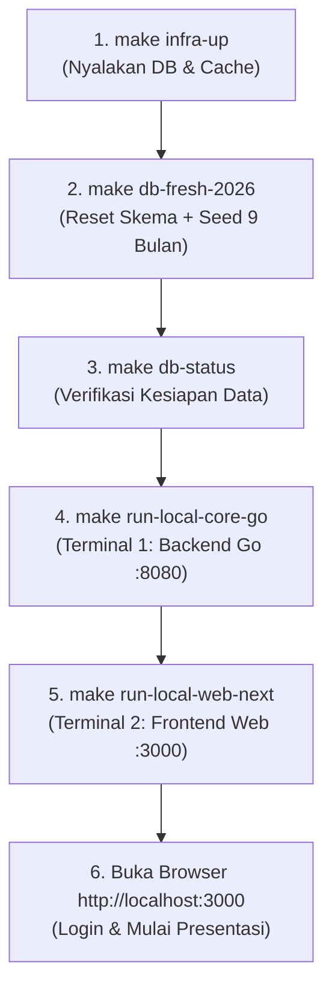

# Panduan Urutan Eksekusi Demo & Variasi Skenario Sistem
## PT. Adijayantara Logistics Indonesia — Cashflow, Shipment & Invoice System

Dokumen ini merupakan panduan praktis operasional (*runbook*) bagi tim teknis, konsultan, dan manajemen untuk mempersiapkan, menjalankan, serta menyajikan demonstrasi sistem aplikasi **PT. Adijayantara Logistics Indonesia** mulai dari awal (*clean slate*) hingga siap dipresentasikan di hadapan eksekutif atau klien.

---

## 🎯 Daftar Isi
1. [Prasyarat Sistem](#1-prasyarat-sistem)
2. [Urutan Utama (Rekomendasi Terbaik: Demo Eksekutif 9 Bulan)](#2-urutan-utama-rekomendasi-terbaik-demo-eksekutif-9-bulan)
3. [Variasi-Variasi Urutan Skenario Demo](#3-variasi-variasi-urutan-skenario-demo)
   - [Variasi 1: Demo Standar Ringkas (Dataset 2 Bulan)](#variasi-1-demo-standar-ringkas-dataset-2-bulan)
   - [Variasi 2: Demo Alur dari Nol Murni (Clean Slate Showcase)](#variasi-2-demo-alur-dari-nol-murni-clean-slate-showcase)
   - [Variasi 3: Demo Transaksi Baru dengan Master Data yang Ada](#variasi-3-demo-transaksi-baru-dengan-master-data-yang-ada)
   - [Variasi 4: Refresh / Injeksi Ulang Data Demo tanpa Hapus Tabel](#variasi-4-refresh--injeksi-ulang-data-demo-tanpa-hapus-tabel)
   - [Variasi 5: Demo Arsitektur API Gateway (Mikroservis)](#variasi-5-demo-arsitektur-api-gateway-mikroservis)
4. [Katalog Akun Login Demo & Wewenang Role](#4-katalog-akun-login-demo--wewenang-role)
5. [Panduan Alur Presentasi di Layar (Demo Presentation Script)](#5-panduan-alur-presentasi-di-layar-demo-presentation-script)
6. [Troubleshooting & Cara Mematikan Layanan](#6-troubleshooting--cara-mematikan-layanan)

---

## 1. Prasyarat Sistem

Sebelum menjalankan demonstrasi, pastikan lingkungan komputer telah terpasang:
- **Docker** atau **Podman** (dengan plugin Compose)
- **GNU Make** (`make`)
- **Golang 1.22+** (untuk menjalankan backend Go lokal)
- **Node.js 18+ & npm** (untuk menjalankan frontend Next.js)

---

## 2. Urutan Utama (Rekomendasi Terbaik: Demo Eksekutif 9 Bulan)

> [!TIP]
> **Skenario ini adalah yang paling direkomendasikan** untuk presentasi rapat direksi, manajemen, maupun peninjauan sistem. Dataset 9 bulan (Januari s.d. September 2026) menyajikan pergerakan visual yang dinamis pada **Tab 2 (Tren Makro)** dan **Tab 3 (Intelijen Strategis)**.



### Langkah demi Langkah Eksekusi Terminal:

### Langkah 1: Nyalakan Kontainer Basis Data & Cache
Jalankan perintah berikut untuk mengaktifkan PostgreSQL 15 dan Redis 7 di latar belakang:
```bash
make infra-up
```
*Port yang dialokasikan: PostgreSQL `5432`, Redis `6379`.*

### Langkah 2: Reset Total Skema & Muat Data Demo 9 Bulan
```bash
make db-fresh-2026
```
**Apa yang dieksekusi oleh sistem:**
1. Menghapus skema database lama (`DROP SCHEMA public CASCADE`).
2. Membuat ulang skema dan mengeksekusi 14 file migrasi SQL (`000001` s.d. `000014`).
3. Menginjeksi dataset riil 9 bulan dari `scripts/database/seed_demo_2026_jan_sep.sql` (ratusan transaksi kas, invoice piutang, pelunasan parsial, reschedule, preset rute, dan rekanan).
4. Membersihkan seluruh cache Redis (`redis-cli flushall`).
5. Mencetak ringkasan baris data dan saldo kas berjalan akhir.

### Langkah 3: Verifikasi Status Data
```bash
make db-status
```
Pastikan seluruh tabel terisi dengan benar dan saldo kas berjalan valid (sekitar ~Rp 712.450.000).

### Langkah 4: Jalankan Backend Core Go API (Terminal 1)
```bash
make run-local-core-go
```
*Layanan backend aktif di `http://localhost:8080`. Biarkan terminal ini tetap menyala.*

### Langkah 5: Jalankan Frontend Next.js (Terminal 2)
Buka tab atau jendela terminal baru:
```bash
make run-local-web-next
```
*Aplikasi web frontend aktif di `http://localhost:3000`. Biarkan terminal ini tetap menyala.*

### Langkah 6: Akses Aplikasi & Mulai Demo
Buka browser Anda dan tuju alamat:
- **Desktop Dashboard**: `http://localhost:3000/dashboard`
- **Mobile PWA View**: `http://localhost:3000/m`

---

## 3. Variasi-Variasi Urutan Skenario Demo

Sistem menyediakan beberapa variasi alur eksekusi sesuai dengan target audiens dan fokus pengujian yang dibutuhkan:

| Skenario | Perintah Database | Waktu Operasional | Tujuan Demonstrasi |
| :--- | :--- | :---: | :--- |
| **Utama (Eksekutif)** | `make db-fresh-2026` | 9 Bulan (Jan–Sep 2026) | Presentasi Direksi, Analitik Makro & 6 Matriks Intelijen Strategis |
| **Variasi 1 (Ringkas)**| `make db-fresh` | 2 Bulan (Agt–Sep) | Demo operasional harian kas berjalan cepat & ringan |
| **Variasi 2 (Nol/Murni)**| `make db-reset` | 0 Transaksi (Kosong) | Menunjukkan alur implementasi awal perusahaan dari nol |
| **Variasi 3 (Clean Tx)**| `make db-clean` | 0 Transaksi (Simpan Master) | Mulai input transaksi kas dari saldo Rp 0 tanpa re-input user/klien |
| **Variasi 4 (Injeksi)**| `make db-seed-2026` / `db-seed` | Menyesuaikan | Mengisi data demo tanpa melakukan drop skema tabel kustom |
| **Variasi 5 (Gateway)** | `make run-local-all-go` | Menyesuaikan | Menunjukkan kesiapan arsitektur mikroservis / API Gateway |

---

### Variasi 1: Demo Standar Ringkas (Dataset 2 Bulan)
Cocok digunakan saat pengujian alur kas operasional harian tanpa riwayat histori yang terlalu panjang.
```bash
# 1. Pastikan infra aktif
make infra-up

# 2. Reset dan muat data 2 bulan (Agustus - September)
make db-fresh

# 3. Cek kesiapan data
make db-status

# 4. Jalankan Services
make run-local-core-go    # Terminal 1
make run-local-web-next   # Terminal 2
```
*Hasil: Database terisi transaksi standar dengan saldo akhir berjalan ~Rp 528.900.000.*

---

### Variasi 2: Demo Alur dari Nol Murni (Clean Slate Showcase)
Cocok untuk mendemokan penerapan sistem di klien baru: bagaimana cara mendaftarkan akun staf, input master customer pertama, membuat preset armada, mencatat modal awal, hingga menerbitkan invoice pertama dari saldo Rp 0.
```bash
# 1. Pastikan infra aktif
make infra-up

# 2. Reset skema ke kondisi kosong murni
make db-reset

# 3. Verifikasi bahwa semua tabel bernilai 0
make db-status

# 4. Jalankan Services
make run-local-core-go    # Terminal 1
make run-local-web-next   # Terminal 2
```
*Hasil: Struktur tabel dan indeks 100% siap, tetapi tidak ada akun atau transaksi sama sekali.*

---

### Variasi 3: Demo Transaksi Baru dengan Master Data yang Ada
Digunakan saat Anda ingin mendemonstrasikan siklus pencatatan kas dari awal (saldo Rp 0), namun **tanpa repot menginput ulang** akun login staf, daftar klien, dan vendor transporter yang sudah ada.
```bash
# 1. Bersihkan hanya transaksi kas, tagihan invoice, dan notifikasi
make db-clean

# 2. Periksa status data
make db-status

# 3. Jalankan aplikasi (jika belum berjalan)
make run-local-core-go    # Terminal 1
make run-local-web-next   # Terminal 2
```
*Hasil: Tabel master user, role, permission, vendor, customer, dan preset armada tetap utuh. Saldo kas kembali ke Rp 0.*

---

### Variasi 4: Refresh / Injeksi Ulang Data Demo tanpa Hapus Tabel
Jika sebelumnya Anda telah menambahkan kolom atau indeks pengujian manual dan tidak ingin skema di-drop total, Anda cukup menginjeksi ulang datanya:
```bash
# Opsi A: Injeksi data komprehensif 9 bulan
make db-seed-2026

# ATAU Opsi B: Injeksi data standar 2 bulan
make db-seed

# Verifikasi
make db-status
```

---

### Variasi 5: Demo Arsitektur API Gateway (Mikroservis)
Digunakan untuk mendemonstrasikan keandalan arsitektur produksi bertingkat di mana seluruh request publik masuk melalui API Gateway (port 8080) yang kemudian meneruskannya ke Core Service (port 8081) dengan validasi Two-Tier Token Redis.
```bash
# 1. Siapkan database
make infra-up
make db-fresh-2026

# 2. Jalankan Core Go (:8081) dan API Gateway (:8080) secara paralel dalam satu terminal
make run-local-all-go

# 3. Jalankan Frontend Next.js di terminal kedua
make run-local-web-next
```

---

## 4. Katalog Akun Login Demo & Wewenang Role

Seluruh akun demo telah dienkripsi dengan algoritma Bcrypt yang aman.

> [!IMPORTANT]
> **Password Default Seluruh Akun Demo adalah:**  
> **`password123`**

| Role Pengguna | Email Login Akun | Fokus Demonstrasi & Karakteristik Wewenang |
| :--- | :--- | :--- |
| **IT Super Admin** | `odealidj.go@gmail.com` | **Root All-Access Bypass.** Mengakses seluruh modul, manajemen pengguna, konfigurasi PBAC, audit log forensik, dan metrik server. |
| **Direktur** | `direktur.wildan@adijayantara.co.id` | **Eksekutif Read-Only.** Cocok untuk demo Rapat Direksi, Tab 2 (Tren Makro), Tab 3 (Intelijen Strategis), serta pengaktifan Mode Rapat. |
| **Direktur** | `direktur.basri@adijayantara.co.id` | **Eksekutif Read-Only.** Akun demo jajaran direksi untuk pengawasan operasional, margin laba, dan supervisi pimpinan. |
| **Pemilik (Owner)** | `owner.adi@adijayantara.co.id` | **Eksekutif Monitoring & Audit Forensik.** Pemantauan likuiditas kas, pengawasan invoice piutang, radar anomali kas (Audit), dan ekspor laporan Excel/PDF. |
| **Finance & Kasir** | `finance.ayu@adijayantara.co.id` | **Operasional Kas & Invoice.** Demo pencatatan kas harian, input pengeluaran, cetak invoice piutang, pelunasan parsial, dan reschedule jatuh tempo. |
| **Admin Bisnis** | `admin.bisnis@adijayantara.co.id` | **Operasional Ekspedisi.** Demo pengelolaan rekanan vendor armada, data klien, preset rute, dan pengelolaan akun staf. |

---

## 5. Panduan Alur Presentasi di Layar (Demo Presentation Script)

Gunakan alur narasi berikut untuk memandu presentasi di depan audiens:

```
[Login: direktur.wildan] 
       │
       ▼
┌─────────────────────────┐
│ 1. Tab Ringkasan Kas    │ ──► Tunjukkan saldo kas berjalan, kas fisik vs bank,
└───────────┬─────────────┘     dan pergerakan kas masuk/keluar harian.
            │
            ▼
┌─────────────────────────┐
│ 2. Tab Tren Makro       │ ──► Perlihatkan grafik tren pertumbuhan bisnis 9 bulan.
└───────────┬─────────────┘     Klik "Perbesar Grafik & Lihat Rincian Tabel Angka".
            │
            ▼
┌─────────────────────────┐
│ 3. Tab Intelijen        │ ──► Jelaskan 6 indikator prediktif eksekutif:
│    Strategis Eksekutif  │     - Runway Kas & Burn Rate (Berapa bulan kas bertahan)
└───────────┬─────────────┘     - Cash Conversion Gap (Selisih waktu terima vs bayar)
            │                   - Matriks BCG Margin Rute (Rute Star vs Dog)
            │                   - Efisiensi & Ketergantungan Vendor Transporter
            │                   - Disiplin Pembayaran Klien (Skor DSO)
            │                   - Analisis Konsentrasi Pareto 80/20 Klien
            │
            ▼
┌─────────────────────────┐
│ 4. Mode Rapat & Focus   │ ──► Aktifkan tombol "Mode Rapat" untuk presentasi proyektor.
└─────────────────────────┘     Klik tombol "Perbesar Grafik" pada salah satu card.
```

---

## 6. Troubleshooting & Cara Mematikan Layanan

### Data di Frontend Belum Berubah setelah Seeding
Jika data di layar tidak segera terbarukan setelah menjalankan `make db-fresh*`, bersihkan cache Redis secara manual:
```bash
make redis-flush
```
Lalu muat ulang (*hard refresh*) halaman peramban web Anda (`Ctrl + F5` atau `Cmd + Shift + R`).

### Memeriksa Konektivitas Container
```bash
make infra-logs
```

### Menghentikan Layanan Setelah Selesai Demo
1. Hentikan terminal backend dan frontend dengan menekan `Ctrl + C`.
2. Matikan seluruh container basis data dan cache:
```bash
make infra-down
```

---

*Dokumen ini merupakan bagian dari repositori resmi PT Adijayantara Logistics Indonesia dan dikelola oleh Tim Engineering.*
