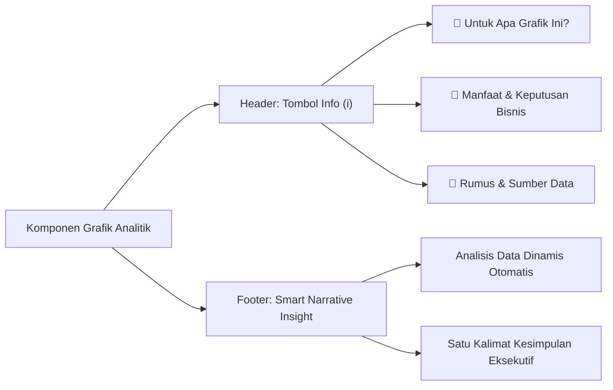
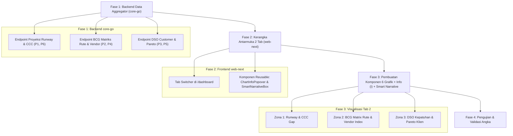

# Perencanaan Strategis Pengembangan Grafik Analitik & Pertumbuhan Bisnis
## PT. Adijayantara Logistics Indonesia — Executive Intelligence & Business Growth Roadmap

Dokumen ini merupakan **cetak biru perencanaan strategis (Strategic Blueprint & Architectural Roadmap)** untuk pengembangan visualisasi dan laporan analitik lanjutan pada platform **PT. Adijayantara Logistics Indonesia**. Tujuannya adalah mentransformasi data operasional kas dan penagihan yang telah tercatat rapi menjadi **alat bantu pengambilan keputusan eksekutif (*Decision Support System*)** guna mempercepat pertumbuhan bisnis (*business growth*), menjaga ketahanan likuiditas kas, dan memaksimalkan margin keuntungan ekspedisi.

Berdasarkan hasil analisis mendalam terhadap halaman menu **"Monitoring Finansial" (`/dashboard`)**, dokumen ini menetapkan arsitektur **Pemisahan 2 Tab Eksekutif (Alternatif A)** guna mengeliminasi 100% potensi duplikasi data serta menyematkan fitur **Icon Info Edukatif `(i)`** dan **Smart Narrative (Insight Eksekutif Otomatis)** pada setiap grafik.

---

## 1. Latar Belakang & Aset Data Eksisting

Saat ini sistem memiliki fondasi pencatatan transaksi yang matang dan konsisten. Seluruh rancangan grafik analitik dalam dokumen ini dibangun **100% berbasis aset data riil yang sudah ada di database**, tanpa memerlukan penambahan entri manual baru oleh staf operasional maupun finance:

1. **Buku Kas Transaksi Cashflow (`cashflow_entries`)**:
   - `kredit` (Kas masuk - modal/pelunasan), `debit` (Kas keluar - operasional jalan/vendor), `saldo` (Kas berjalan).
   - `grand_selling` (Harga jual tagihan ke customer), `grand_cost` (Biaya pokok rekanan armada/vendor), `profit`, `margin_pct`.
   - `vendor_id`, `vendor_name_raw`, `top_days`, `due_date` vendor, dan status pembayaran vendor (`remarks`: `PAID` / `UNPAID`).
   - `act_information` (Customer/Proyek), `act_explaination` (Rute/Koridor pengiriman/Muatan), `date_of_entry`.
2. **Buku Penagihan Invoice Customer (`invoices`)**:
   - `client_name`, `amount`, `shipment_date`, `top_days`, `due_date`, `original_due_date`, `paid_at`, status (`PAID` / `UNPAID` / `OVERDUE`).
3. **Audit Log & Riwayat Perilaku Pelanggan (`invoice_due_date_histories` & `invoice_payment_histories`)**:
   - `reschedule_count`, riwayat penambahan hari tempo (`days_added`), alasan perubahan (`reason`), riwayat cicilan pembayaran.
4. **Master Entitas Bisnis (`customers` & `vendors`)**:
   - Data entitas rekanan armada ekspedisi dan pelanggan korporasi.

---

## 2. Arsitektur Antarmuka: Sistem 2 Tab Bebas Duplikasi (Alternatif A)

### A. Mengapa Memilih Pemisahan 2 Tab (Alternatif A)?
Audit mendalam terhadap halaman "Monitoring Finansial" saat ini menunjukkan bahwa halaman sudah memiliki 4 tingkat (*tiers*) yang padat (5 kartu KPI, 1 grafik tren pertumbuhan, 2 kartu rasio likuiditas/aging piutang, dan 2 panel prioritas penagihan & top rute).

Jika 6 grafik analitik strategis baru ditumpuk ke halaman yang sama:
1. **Terjadi Duplikasi Sudut Pandang**: Panel *Top Rute* eksisting akan bertabrakan dengan *Matriks Kuadran BCG Rute*, dan *Aging Piutang* akan bertabrakan dengan *Skor DSO Kepatuhan Customer*.
2. **Kepadatan Halaman Berlebih (*Scroll Fatigue*)**: Halaman akan memuat lebih dari 16 blok visual, membuat waktu muat (*loading*) lambat dan menyulitkan eksekutif menemukan informasi penting dengan cepat.

Dengan **Pemisahan 2 Tab Eksekutif**, peran masing-masing tab terisolasi dengan tujuan bisnis yang tegas:

```
┌──────────────────────────────────────────────────────────────────────────────────────────┐
│ [Monitoring Finansial] PT Adijayantara Logistics Indonesia                               │
├──────────────────────────────────────────────────────────────────────────────────────────┤
│  [ TAB 1: 📊 Operasional & Kas Berjalan ]   [ TAB 2: 🚀 Intelijen Strategis & Pertumbuhan ] │
└──────────────────────────────────────────────────────────────────────────────────────────┘
```

### B. Distribusi Konten per Tab

#### 1. Tab 1: Operasional & Kas Berjalan (*Daily Operations Pulse*)
*Fokus: Pemantauan kesehatan operasional harian, arus kas berjalan, dan tindakan taktis jangka pendek (minggu berjalan).*
* **Toolbar Periode Terpadu**: Filter rentang tanggal (Bulan ini, bulan lalu, kuartalan, kustom).
* **Tier 1 (5 KPI Cards)**: Saldo Kas Riil, Total Omset Tagihan, Laba & Margin %, Piutang Customer (AR), Kewajiban Vendor (AP).
* **Tier 2 (Growth Chart)**: `BusinessGrowthChart` interaktif (Tren Finansial, Volume Trip, Klien Aktif) + *Smart Narrative*.
* **Tier 3 (Visual Analytics)**:
  - Likuiditas Arus Kas (Rasio Inflow Kredit vs Outflow Debit real-time).
  - Kesehatan & Aging Piutang Customer (Lunas, Menunggu TOP, Overdue).
* **Tier 4 (Action Panels)**:
  - Prioritas Penagihan Piutang (`UrgentInvoicesPanel` — 5 invoice jatuh tempo yang mendesak difollow-up).
  - Rute Paling Menguntungkan (`TopRoutesAnalyticsPanel` — Top 5 rute kontributor profit terbesar).

#### 2. Tab 2: Intelijen Strategis & Pertumbuhan (*Executive Strategy & Growth Intelligence*)
*Fokus: Analisis strategis jangka menengah & panjang untuk direksi (perencanaan modal kerja, mitigasi risiko vendor, evaluasi portofolio rute dan kualitas kredit pelanggan).*
* **Zona 1 — Likuiditas & Ketahanan Modal Kerja**:
  - **P1**: Proyeksi Arus Kas 30–60 Hari ke Depan (*Cashflow Runway Forecast*).
  - **P6**: Gap Siklus Konversi Kas (*Cash Conversion Cycle / Working Capital GAP*).
* **Zona 2 — Profitabilitas Koridor & Armada Rekanan**:
  - **P2**: Matriks Kuadran Profitabilitas Rute (*Logistics BCG Matrix: Stars, Opportunities, Cash Cows, Dogs*).
  - **P4**: Analisis Efisiensi & Ketergantungan Rekanan Vendor (*Vendor Concentration & Margin Index*).
* **Zona 3 — Portofolio & Kualitas Pelanggan**:
  - **P3**: Skor Kepatuhan Tempo & DSO per Customer (*Customer DSO & Payment Discipline*).
  - **P5**: Konsentrasi Portofolio Pelanggan (*Pareto 80/20 & Churn Early Warning*).

---

## 3. Standar Interaktivitas: Icon Info Edukatif `(i)` & Smart Narrative

Setiap grafik analitik di Tab 2 (dan komponen utama di Tab 1) wajib mengimplementasikan **dua pilar interaktivitas eksekutif**:



### A. Spesifikasi Icon Info Edukatif `(i)` (*Interactive Explainer Popover*)
Terletak di sisi kanan header kartu grafik. Ketika diklik, akan memunculkan jendela mini (*popover*) yang menyajikan 3 elemen informasi padat:
1. **Untuk Apa Grafik Ini? (*What It Is*)**: Penjelasan lugas tanpa istilah akuntansi yang rumit mengenai apa yang divisualisasikan.
2. **Manfaat Bisnis (*Actionable Decisions*)**: Keputusan nyata apa yang bisa diambil oleh direksi/manajemen setelah melihat grafik tersebut.
3. **Rumus & Sumber Data (*Formula & Lineage*)**: Menjelaskan kalkulasi data riil yang digunakan dari database agar transparan dan dapat diverifikasi.

### B. Spesifikasi Smart Narrative (*Executive Insight Dinamis*)
Terletak di bagian bawah kartu grafik. Sistem membaca data yang sedang aktif dan secara otomatis merumuskan kesimpulan bisnis dalam 1–2 kalimat terarah, dilengkapi penanda visual (*badge* status: 🟢 Aman, 🟡 Perhatian, 🔴 Kritis).

---

## 4. Spesifikasi Lengkap 6 Grafik Analitik Baru (Tab 2)

---

### 🌟 Prioritas 1 (P1): Proyeksi Arus Kas 30–60 Hari ke Depan (Cashflow Forward Runway Forecast)

#### A. Deskripsi & Filosofi Bisnis
Di industri logistik ekspedisi, risiko terbesar bukanlah ketiadaan omset, melainkan **defisit kas sementara (*Cash Gap*)**. Perusahaan wajib membayar solar dan uang jalan vendor rekanan di muka atau tempo pendek (14 hari), sementara pembayaran tagihan dari klien korporat baru cair di hari ke-45 atau ke-60. Grafik ini memproyeksikan saldo kas harian/mingguan selama 4 hingga 8 minggu ke depan.

#### B. Spesifikasi Teknis Visual
* **Tipe Visualisasi**: **Stepped Area Chart & Line** dengan garis putus-putus ambang batas aman kas (*Minimum Cash Buffer Threshold*, misal Rp 25.000.000).
* **Sumber Data**:
  - Posisi Awal ($t_0$): `cashflowSummary.current_saldo` (Kas riil saat ini).
  - Proyeksi Kas Masuk (+): `invoices` status `UNPAID` dikelompokkan per tanggal `invoices.due_date`.
  - Proyeksi Kas Keluar (-): `cashflow_entries` status `remarks == 'UNPAID'` dikelompokkan per tanggal tempo `cashflow_entries.due_date`.
* **Formula Perhitungan**:
  $$\text{Saldo Kas Hari ke-}t = \text{Saldo Saat Ini} + \sum_{i=1}^{t} \text{Invoice Jatuh Tempo} - \sum_{i=1}^{t} \text{Hutang Vendor Jatuh Tempo}$$

#### C. Isi Modal Info Edukatif `(i)`
* **🎯 Untuk Apa Grafik Ini?**: Memetakan perkiraan posisi saldo kas perusahaan setiap minggu selama 1-2 bulan ke depan berdasarkan jadwal jatuh tempo invoice yang akan cair dikurangi tagihan rekanan vendor yang harus dibayar.
* **💼 Manfaat Bisnis**:
  1. Memberikan peringatan dini (*early warning*) sebelum kas perusahaan jatuh ke zona minus/defisit.
  2. Menentukan jadwal aman bagi finance untuk melunasi tagihan vendor besar tanpa mengganggu operasional harian.
  3. Mengidentifikasi minggu-minggu kritis di mana penagihan piutang harus dilakukan secara agresif.
* **📐 Rumus Data**: `Saldo Berjalan = Saldo Kas Aktif + Akumulasi Piutang Jatuh Tempo - Akumulasi Hutang Vendor Jatuh Tempo`.

#### D. Contoh Smart Narrative Otomatis
> 🟢 **Insight Likuiditas**: *"Posisi kas diproyeksikan aman selama 30 hari ke depan. Titik saldo terendah diprediksi terjadi pada tanggal 24 September sebesar Rp 38,4 Jt (di atas ambang batas aman Rp 25 Jt)."*

---

### 🌟 Prioritas 2 (P2): Matriks Kuadran Profitabilitas Rute (Logistics Corridor BCG Matrix)

#### A. Deskripsi & Filosofi Bisnis
Setiap koridor rute pengiriman memiliki karakteristik ekonomi yang berbeda. Ada rute dengan volume muatan padat namun margin keuntungannya tipis karena tingginya biaya armada rekanan atau retribusi, dan ada rute sepi namun marginnya sangat tebal. Grafik kuadran 4-bubble ini memetakan seluruh rute operasional perusahaan ke dalam kuadran strategis.

#### B. Spesifikasi Teknis Visual
* **Tipe Visualisasi**: **Scatter / Bubble Chart 4-Kuadran**:
  - Sumbu X: Frekuensi Pengiriman (Total Ritase Trip).
  - Sumbu Y: Rerata Persentase Margin Laba (`margin_pct`).
  - Ukuran Bubble (Radius): Total Omset Penjualan (`grand_selling`).
  - Garis Pembagi Kuadran: Rata-rata Ritase Sistem & Ambang Batas Margin Standar (misal 12%).
* **Sumber Data**: `cashflow_entries.act_explaination` (Rute), `profit`, `grand_cost`, `grand_selling`.
* **Klasifikasi 4 Kuadran**:
  1. **Kuadran I — Bintang (*Stars - High Volume, High Margin*)**: Rute tambang emas. Wajib diprioritaskan unit armadanya dan dijaga hubungan dengan klien terkait.
  2. **Kuadran II — Potensial (*Opportunities - Low Volume, High Margin*)**: Rute sangat menguntungkan namun frekuensinya belum optimal. Menjadi target utama tim sales untuk mencari muatan tambahan.
  3. **Kuadran III — Sapi Perah (*Volume Drivers - High Volume, Low Margin*)**: Rute penopang arus perputaran kas harian. Fokus utama adalah menekan biaya solar dan negosiasi sewa vendor agar margin naik.
  4. **Kuadran IV — Evaluasi Kritis (*Dogs - Low Volume, Low Margin*)**: Rute berisiko tinggi yang menyerap modal tanpa hasil sepadan. Sinyal bagi direksi untuk menaikkan harga jual atau menghentikan rute tersebut.

#### C. Isi Modal Info Edukatif `(i)`
* **🎯 Untuk Apa Grafik Ini?**: Memetakan seluruh rute perjalanan ekspedisi ke dalam 4 kuadran performa berdasarkan seberapa sering rute tersebut dijalankan dan seberapa besar margin keuntungan yang dihasilkan.
* **💼 Manfaat Bisnis**:
  1. Membantu direksi menentukan rute mana yang layak diekspansi dan rute mana yang harus dievaluasi tarifnya.
  2. Menghindari "jebakan omset besar": rute yang tampak ramai pengiriman tetapi ternyata marginnya habis dimakan biaya jalan.
  3. Memberikan panduan bagi tim operasional dalam memprioritaskan alokasi armada terbaik.
* **📐 Rumus Data**: `Sumbu X = COUNT(trip)`, `Sumbu Y = AVG(profit / grand_selling * 100%)`, `Radius = SUM(grand_selling)`.

#### D. Contoh Smart Narrative Otomatis
> 💡 **Insight Portofolio Rute**: *"Rute **Surabaya – Banjarmasin** merupakan rute Bintang utama (Menyumbang laba Rp 54 Jt dengan margin 23,4%). Sementara rute **Semarang – Cirebon** masuk kuadran evaluasi karena margin di bawah 6% meskipun dijalankan 18 kali."*

---

### 🌟 Prioritas 3 (P3): Skor Kepatuhan Tempo & DSO per Customer (Customer DSO & Payment Discipline)

#### A. Deskripsi & Filosofi Bisnis
Mengukur kredibilitas dan kebiasaan pembayaran masing-masing pelanggan korporat. Grafik ini membedakan pelanggan yang tertib membayar sesuai perjanjian kredit dengan pelanggan yang gemar menunda pembayaran atau berulang kali meminta perpanjangan tempo (*reschedule*).

#### B. Spesifikasi Teknis Visual
* **Tipe Visualisasi**: **Grouped Bar Horizontal** dengan Penanda Warna Disiplin:
  - Batang 1: Janji Tempo Invoice Resmi (`invoices.top_days`, misal 30 hari).
  - Batang 2: Realisasi Hari Pelunasan Riil / DSO (`DSO = paid_at - shipment_date`).
  - Badge Khusus: Frekuensi perpanjangan tempo (`invoices.reschedule_count`).
* **Klasifikasi Kepatuhan**:
  - 🟢 **Prime (Sangat Disiplin)**: Realisasi DSO $\le$ Janji TOP.
  - 🟡 **Moderate (Keterlambatan Wajar)**: Realisasi DSO terlambat 1–7 hari dari TOP.
  - 🔴 **High Risk (Kritis/Bermasalah)**: Terlambat $>14$ hari atau memiliki `reschedule_count \ge 2`.

#### C. Isi Modal Info Edukatif `(i)`
* **🎯 Untuk Apa Grafik Ini?**: Membandingkan berapa hari janji tempo pembayaran pelanggan (TOP) dengan kenyataan berapa hari pelanggan tersebut benar-benar melunasi tagihannya (*Days Sales Outstanding / DSO*).
* **💼 Manfaat Bisnis**:
  1. Menentukan plafon kredit (*credit limit*) dan kelayakan perpanjangan kontrak bagi masing-masing customer.
  2. Memberikan sanksi tegas atau syarat pembayaran uang muka (*Cash Before Delivery / CBD*) bagi klien berstatus High Risk sebelum armada diberangkatkan.
  3. Mencegah akumulasi piutang macet yang membebani kas perusahaan.
* **📐 Rumus Data**: `TOP = invoices.top_days`, `DSO Riil = invoices.paid_at - invoices.shipment_date`.

#### D. Contoh Smart Narrative Otomatis
> ⚠️ **Insight Kepatuhan Customer**: *"Rata-rata DSO pelanggan adalah 36 hari (melebihi standar TOP 30 hari). **PT Sumber Berkah** tercatat paling kritis dengan realisasi bayar 52 hari dan telah melakukan perpanjangan tempo sebanyak 3 kali."*

---

### 🌟 Prioritas 4 (P4): Analisis Efisiensi & Ketergantungan Rekanan Vendor (Vendor Concentration & Margin Index)

#### A. Deskripsi & Filosofi Bisnis
Biaya rekanan armada vendor (`grand_cost`) merupakan porsi pengeluaran operasional terbesar perusahaan. Laporan ini mengevaluasi apakah tarif sewa yang dibayarkan ke rekanan sebanding dengan keuntungan bersih yang dihasilkan, serta mengukur risiko jika operasional perusahaan terlalu bergantung pada satu rekanan armada tertentu (*vendor dependency risk*).

#### B. Spesifikasi Teknis Visual
* **Tipe Visualisasi**: **Dual-Axis Horizontal Bar & Line Chart**:
  - Sumbu Bar (Bawah): Total Biaya Pembayaran ke Vendor (Rp) & Total Ritase Armada.
  - Sumbu Garis (Atas): Rata-rata Persentase Margin Keuntungan yang dihasilkan dari vendor tersebut (%).
  - Indikator Konsentrasi: Persentase kontribusi ritase vendor terhadap total ritase seluruh perusahaan.
* **Sumber Data**: `cashflow_entries.vendor_name_raw`, `vendor_id`, `grand_cost`, `grand_selling`, `profit`, `margin_pct`.

#### C. Isi Modal Info Edukatif `(i)`
* **🎯 Untuk Apa Grafik Ini?**: Mengukur seberapa besar biaya yang kita bayarkan ke masing-masing rekanan vendor ekspedisi, berapa margin keuntungan yang kita peroleh dari muatan mereka, serta seberapa besar tingkat ketergantungan armada kita pada vendor tersebut.
* **💼 Manfaat Bisnis**:
  1. Menjadi dasar data yang kuat bagi manajemen untuk menegosiasikan potongan harga sewa armada pada vendor bervolume besar (*bargaining power*).
  2. Mengidentifikasi vendor "emas" yang konsisten memberikan margin tinggi (>15%) untuk dijadikan rekanan prioritas.
  3. Mencegah risiko operasional lumpuh jika salah satu vendor monopoli mendadak menaikkan tarif atau memutus armada secara sepihak.
* **📐 Rumus Data**: `Biaya = SUM(grand_cost)`, `Margin = AVG(profit / grand_selling * 100%)`, `Rasio Ketergantungan = (Trip Vendor / Total Trip) * 100%`.

#### D. Contoh Smart Narrative Otomatis
> 💡 **Insight Rekanan Vendor**: *"Tingkat ketergantungan armada tertinggi ada pada **Vendor CV Maju Logistik** (menguasai 44% dari total trip). Rekanan dengan kontribusi margin profit tertinggi adalah **PT Trans Samudra** (rata-rata margin 19,8%)."*

---

### 🌟 Prioritas 5 (P5): Konsentrasi Portofolio Pelanggan (Pareto 80/20 & Churn Early Warning)

#### A. Deskripsi & Filosofi Bisnis
Mengukur stabilitas dan kerapuhan portofolio pendapatan perusahaan berdasarkan hukum Pareto 80/20: *"Apakah 80% omset perusahaan hanya bertumpu pada 2 atau 3 pelanggan besar?"*. Selain itu, grafik ini mendeteksi sinyal dini (*early warning*) apabila ada pelanggan loyal yang frekuensi pesanannya mulai menurun drastis (*potensi churn*).

#### B. Spesifikasi Teknis Visual
* **Tipe Visualisasi**: **Kurva Pareto Kumulatif & Sparkline Tren Frekuensi**:
  - Bar: Nilai total omset per customer (diurutkan dari nominal terbesar ke terkecil).
  - Line: Persentase akumulasi omset kumulatif (0% – 100%).
  - Garis Ambang Batas: Garis batas 80% omset perusahaan.
  - Penanda Churn: Badge kuning `🟡 POTENSI CHURN` jika frekuensi trip customer di bulan berjalan turun $>40\%$ dibanding rata-rata 3 bulan terakhir.
* **Sumber Data**: `invoices.client_name`, `invoices.amount`, dan riwayat ritase bulanan di `cashflow_entries`.

#### C. Isi Modal Info Edukatif `(i)`
* **🎯 Untuk Apa Grafik Ini?**: Menunjukkan sebaran kontribusi pendapatan dari para pelanggan korporat dan mendeteksi apakah kelangsungan hidup perusahaan terlalu bertumpu pada segelintir pelanggan saja, sekaligus memantau keaktifan order mereka.
* **💼 Manfaat Bisnis**:
  1. Menyadarkan manajemen jika portofolio bisnis rapuh (misal: kehilangan 1 klien besar bisa menghilangkan 50% pendapatan).
  2. Mendorong tim pemasaran untuk mendiversifikasi klien baru ke berbagai sektor industri.
  3. Memberikan peringatan cepat bagi tim sales/account manager untuk segera menjadwalkan kunjungan kepada klien yang frekuensi ordernya menurun sebelum mereka berpindah ke kompetitor.
* **📐 Rumus Data**: `Akumulasi % = (SUM Kumulatif Omset Klien / Total Omset) * 100%`.

#### D. Contoh Smart Narrative Otomatis
> ⚠️ **Insight Portofolio Pelanggan**: *"Tingkat konsentrasi pendapatan tinggi: 2 klien teratas (**PT Multi Prima** dan **PT Sentosa Makmur**) menyumbang 71% dari total omset perusahaan. Perhatian: Klien **PT Surya Gemilang** mengalami penurunan order sebesar 45% dalam 30 hari terakhir."*

---

### 🌟 Prioritas 6 (P6): Gap Siklus Konversi Kas (Cash Conversion Cycle / Working Capital GAP)

#### A. Deskripsi & Filosofi Bisnis
Menghitung selisih waktu riil antara kewajiban membayar rekanan vendor armada dengan waktu penerimaan kas dari tagihan invoice customer. Gap hari inilah yang menentukan berapa lama uang kas perusahaan harus "tertahan di jalan" sebelum kembali menjadi kas tunai.

#### B. Spesifikasi Teknis Visual
* **Tipe Visualisasi**: **Bi-directional Comparative Bar**:
  - Sisi Kiri/Atas (Biru): Rata-rata hari pelunasan customer (*Days Sales Invoiced / DSO*).
  - Sisi Kanan/Bawah (Merah): Rata-rata hari pembayaran vendor (*Days Payable Outstanding / DPO*).
  - Indikator Tengah: **Financing Working Capital GAP (Jumlah Hari)**.
* **Sumber Data**: `invoices.top_days` / DSO vs `cashflow_entries.top_days` / DPO.
* **Formula Perhitungan**:
  $$\text{Working Capital Financing Gap (Hari)} = \text{Rata-rata Tempo Customer (Hari)} - \text{Rata-rata Tempo Vendor (Hari)}$$

#### C. Isi Modal Info Edukatif `(i)`
* **🎯 Untuk Apa Grafik Ini?**: Menghitung selisih hari antara berapa lama perusahaan harus menunggu uang masuk dari tagihan customer dibandingkan dengan seberapa cepat perusahaan harus membayar tagihan rekanan vendor armada.
* **💼 Manfaat Bisnis**:
  1. Mengetahui beban modal kerja (*working capital*) yang harus ditalangi oleh kas perusahaan setiap kali menerima order baru.
  2. Menjadi acuan divisi legal dan sales saat menandatangani kontrak baru: menyelaraskan tempo customer agar seimbang dengan tempo vendor.
  3. Memperkecil kebutuhan pinjaman modal kerja dari pihak luar (bank/pembiayaan).
* **📐 Rumus Data**: `Financing Gap = Rata-rata Hari Pelunasan Customer - Rata-rata Hari Bayar Vendor`.

#### D. Contoh Smart Narrative Otomatis
> 💡 **Insight Siklus Konversi Kas**: *"Financing Gap modal kerja saat ini adalah **22 hari** (Customer membayar rata-rata dalam 36 hari, sementara vendor wajib dibayar dalam 14 hari). Perusahaan menalangi operasional rata-rata sebesar Rp 65 Jt per putaran ritase."*

---

## 5. Roadmap Rencana Implementasi Bertahap

Pekerjaan implementasi akan dilakukan secara modular tanpa memutus operasional harian:



### Tahap 1: Backend Data Aggregation (`services/core-go`)
* Membuat query SQL teroptimasi (`GROUP BY`, window functions, kalkulasi tanggal) dengan waktu eksekusi sangat cepat (`< 25 ms`).
* Menyediakan endpoint REST API terpadu:
  - `GET /api/v1/analytics/cashflow-runway` (Data P1 & P6)
  - `GET /api/v1/analytics/route-matrix` (Data P2)
  - `GET /api/v1/analytics/customer-dso-pareto` (Data P3 & P5)
  - `GET /api/v1/analytics/vendor-performance` (Data P4)

### Tahap 2: Kerangka Antarmuka 2 Tab & Komponen Reusable (`apps/web-next`)
* Menambahkan switch tab di `apps/web-next/src/app/dashboard/page.tsx`:
  - `activeTab === 'operations'` (Menampilkan Tab 1 eksisting).
  - `activeTab === 'strategy'` (Menampilkan Tab 2 baru).
* Membangun komponen antarmuka yang dapat dipakai ulang:
  - `ChartInfoPopover.tsx`: Popover modal untuk Icon Info `(i)`.
  - `SmartNarrativeBox.tsx`: Kontainer narasi eksekutif otomatis yang konsisten.

### Tahap 3: Konstruksi Visual Komponen 6 Grafik Strategis
* Membangun 6 komponen visual modular di direktori `src/components/dashboard/strategy/`:
  1. `CashflowRunwayChart.tsx` (P1)
  2. `RouteBCGMatrixChart.tsx` (P2)
  3. `CustomerDsoDisciplineChart.tsx` (P3)
  4. `VendorEfficiencyChart.tsx` (P4)
  5. `CustomerParetoChart.tsx` (P5)
  6. `CashConversionGapCard.tsx` (P6)
* Menyelaraskan skema warna standar (*Nordic Navy*, *Sky Blue*, *Emerald Green*, *Amber Alert*, dan *Rose Danger*).

### Tahap 4: Verifikasi & Uji Ketepatan Data
* Membandingkan hasil agregasi analitik dengan data riil pada buku kas dan faktur invoice.
* Memastikan fungsi Icon Info `(i)` dan Smart Narrative berjalan interaktif dan responsif di berbagai resolusi layar.

---

## 6. Kesimpulan & Nilai Tambah Strategis

Dengan mengadopsi **Alternatif A (Pemisahan 2 Tab)** yang dilengkapi **Icon Info `(i)`** dan **Smart Narrative**:

1. **Dashboard Harian Tetap Bersih & Cepat**: Tab 1 fokus melayani kebutuhan staf dan manajemen untuk kontrol arus kas dan invoice harian tanpa kebingungan.
2. **Tab 2 Menjadi Ruang Kendali Direksi (*Executive Cockpit*)**: Memberikan pandangan helikopter yang tajam tentang arah pertumbuhan bisnis, efisiensi mitra kerja, dan ketahanan modal tanpa tumpang tindih data.
3. **Edukasi & Keputusan Cepat**: Setiap grafik mengajarkan manfaat bisnisnya sendiri melalui tombol `(i)`, sementara Smart Narrative langsung merumuskan kesimpulan bisnis bagi para pengambil keputusan.
