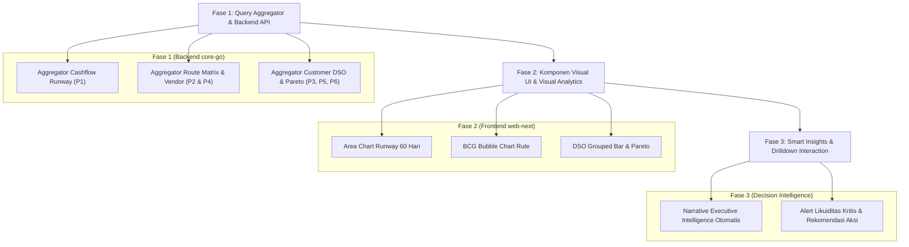

# Perencanaan Strategis Pengembangan Grafik Analitik & Pertumbuhan Bisnis
## PT. Adijayantara Logistics Indonesia — Executive Intelligence & Business Growth Roadmap

Dokumen ini merupakan **cetak biru perencanaan strategis (Strategic Roadmap)** untuk pengembangan visualisasi dan laporan analitik lanjutan pada platform **PT. Adijayantara Logistics Indonesia**. Tujuannya adalah mentransformasi data operasional kas dan penagihan yang telah tercatat rapi menjadi **alat bantu pengambilan keputusan eksekutif (*Decision Intelligence*)** guna mempercepat pertumbuhan bisnis (*business growth*), menjaga likuiditas kas, dan memaksimalkan margin keuntungan ekspedisi.

---

## 1. Latar Belakang & Aset Data Eksisting

Saat ini sistem memiliki fondasi pencatatan transaksi yang matang dan konsisten. Seluruh rancangan grafik analitik dalam dokumen ini dibangun **100% berbasis aset data riil yang sudah ada di database**, tanpa memerlukan penambahan entri manual baru oleh staf operasional maupun finance:

1. **Buku Kas Transaksi Cashflow (`cashflow_entries`)**:
   - `kredit` (Kas masuk - modal/pelunasan), `debit` (Kas keluar - operasional jalan/vendor), `saldo` (Kas berjalan).
   - `grand_selling` (Harga jual tagihan ke customer), `grand_cost` (Biaya pokok rekanan armada/vendor), `profit`, `margin_pct`.
   - `vendor_id`, `vendor_name_raw`, `top_days`, `due_date` vendor, dan status pembayaran vendor (`remarks`: `PAID` / `UNPAID`).
   - `act_information` (Customer/Proyek), `act_explaination` (Rute/Koridor pengiriman/Muatan), `date_of_entry`.
2. **Buku Penagihan Invoice Customer (`invoices`)**:
   - `client_name`, `amount`, `shipment_date`, `top_days`, `due_date`, `original_due_date`, `paid_at`, status (`PAID` / `UNPAID` / `OVERDUE`).
3. **Audit Log & Riwayat Perilaku Pelanggan (`invoice_due_date_histories` & `invoice_payment_histories`)**:
   - `reschedule_count`, riwayat penambahan hari tempo (`days_added`), alasan perubahan (`reason`), riwayat cicilan pembayaran.
4. **Master Entitas Bisnis (`customers` & `vendors`)**:
   - Data entitas rekanan armada ekspedisi dan pelanggan korporasi.

---

## 2. Matriks Prioritas Pengembangan (P1 – P6)

Berdasarkan dampak langsung terhadap **ketahanan modal kerja (*working capital*)**, **keuntungan bersih (*profitability*)**, dan **kesiapan struktur data**, berikut urutan prioritas pengembangannya:

| Prioritas | Nama Laporan Grafik | Fokus Dampak Bisnis | Kesiapan Data |
| :---: | :--- | :--- | :---: |
| **P1** | **Proyeksi Arus Kas 30–60 Hari (Cashflow Forward Runway)** | **Ketahanan Likuiditas**: Menjamin kas tidak pernah defisit akibat selisih waktu bayar vendor vs customer. | Siap 100% |
| **P2** | **Matriks Kuadran Profitabilitas Rute (Logistics BCG Matrix)** | **Strategi Ekspansi Penjualan**: Menemukan koridor rute tambang emas (*high margin*) dan rute yang membuang biaya. | Siap 100% |
| **P3** | **Skor Kepatuhan DSO & Disiplin Bayar Customer** | **Mitigasi Piutang Macet**: Menilai reputasi pembayaran klien dan mengendalikan batas plafon kredit (*credit limit*). | Siap 100% |
| **P4** | **Analisis Efisiensi & Ketergantungan Rekanan Vendor** | **Pengendalian HPP**: Menekan biaya sewa armada jalan dan mengurangi risiko monopoli vendor tertentu. | Siap 100% |
| **P5** | **Konsentrasi Portofolio Pelanggan (Pareto 80/20 & Churn)** | **Diversifikasi Pendapatan**: Mencegah kerapuhan bisnis jika kehilangan klien besar dan mendeteksi penurunan order. | Siap 100% |
| **P6** | **Gap Siklus Konversi Kas (Cash Conversion Cycle / CCC Gap)** | **Efisiensi Modal Kerja**: Menyelaraskan selisih hari tempo customer vs tempo vendor agar kas mandiri tanpa pinjaman. | Siap 100% |

---

## 3. Spesifikasi Lengkap 6 Grafik Analitik Baru

---

### 🌟 Prioritas 1 (P1): Proyeksi Arus Kas 30–60 Hari ke Depan (Cashflow Forward Runway Forecast)

#### A. Deskripsi & Filosofi Bisnis
Di industri logistik, perusahaan ekspedisi sering kali mengalami kendala bukan karena ketiadaan omset, melainkan karena **defisit likuiditas sementara (*Cash Gap*)**. Contoh: Perusahaan harus membayar vendor armada atau solar pada hari ke-14, sementara customer baru melunasi invoice pada hari ke-45 atau ke-60. Grafik ini memproyeksikan posisi saldo kas harian/mingguan selama 4 hingga 8 minggu ke depan.

#### B. Spesifikasi Teknis
* **Tipe Visualisasi**: **Stepped Area Chart & Line** dengan batas ambang aman kas (*Minimum Cash Buffer Threshold*).
* **Sumber Data**:
  * *Posisi Awal*: `cashflowSummary.current_saldo` (Kas riil saat ini).
  * *Proyeksi Pemasukan (+)*: Seluruh `invoices` status `UNPAID` dikelompokkan berdasarkan tanggal jatuh tempo (`invoices.due_date`).
  * *Proyeksi Pengeluaran (-)*: Seluruh transaksi `cashflow_entries` yang kewajiban vendornya belum dibayar (`remarks == 'UNPAID'`) dikelompokkan berdasarkan tanggal jatuh tempo vendor (`cashflow_entries.due_date`).
* **Formula Perhitungan Proyeksi Saldo**:
  $$\text{Saldo Kas Hari ke-}t = \text{Saldo Saat Ini} + \sum_{i=1}^{t} \text{Invoice Tagihan Jatuh Tempo} - \sum_{i=1}^{t} \text{Kewajiban Vendor Jatuh Tempo}$$
* **Pertanyaan Bisnis yang Dijawab**:
  * *"Apakah di minggu ke-3 kas kita akan minus karena ada tagihan vendor besar sebelum invoice customer cair?"*
  * *"Berapa saldo kas minimum yang akan kita miliki di akhir bulan depan jika semua pihak membayar sesuai jadwal tempo?"*
* **Tindakan Manajerial (Actionable Decision)**:
  * Melakukan penagihan proaktif pada invoice customer 7 hari sebelum jatuh tempo jika diprediksi ada defisit kas.
  * Menegosiasikan perpanjangan jadwal pembayaran vendor pada minggu-minggu kritis sebelum kas jatuh ke zona merah.

---

### 🌟 Prioritas 2 (P2): Matriks Kuadran Profitabilitas Rute (Logistics Corridor BCG Matrix)

#### A. Deskripsi & Filosofi Bisnis
Tidak semua rute ekspedisi diciptakan setara. Ada rute yang muatannya sangat padat tetapi margin keuntungannya tipis karena tingginya biaya vendor atau retribusi jalan, dan sebaliknya ada rute yang jarang tetapi marginnya sangat tebal. Grafik kuadran ini memetakan seluruh rute operasional ke dalam 4 kuadran strategis.

#### B. Spesifikasi Teknis
* **Tipe Visualisasi**: **Scatter / Bubble Chart 4-Kuadran**:
  * Sumbu X: Frekuensi Pengiriman (Total Ritase Trip)
  * Sumbu Y: Rerata Persentase Margin Keuntungan (`margin_pct`)
  * Ukuran Lingkaran (Bubble Size): Total Omset Penjualan (`grand_selling`)
  * Garis Pembagi Kuadran: Rata-rata Ritase Sistem & Ambang Batas Margin Sehat (misal 12%)
* **Sumber Data**:
  * `cashflow_entries.act_explaination` (Trayek/Rute), `profit`, `grand_cost`, `grand_selling`.
* **Klasifikasi 4 Kuadran**:
  1. **Kuadran I — Bintang (*Stars - High Volume, High Margin*)**: Rute tambang emas. Wajib diprioritaskan alokasi armadanya dan dijaga relasi kliennya.
  2. **Kuadran II — Potensial (*Opportunities - Low Volume, High Margin*)**: Rute sangat menguntungkan namun volume belum optimal. Target utama tim sales untuk mencari muatan tambahan.
  3. **Kuadran III — Sapi Perah (*Volume Drivers - High Volume, Low Margin*)**: Rute penopang arus kas harian. Fokus pada efisiensi biaya vendor dan solar agar margin tidak tergerus.
  4. **Kuadran IV — Evaluasi Kritis (*Dogs - Low Volume, Low Margin*)**: Rute berisiko. Sinyal bagi direksi untuk menaikkan tarif muatan atau menutup rute tersebut jika tidak prospektif.
* **Tindakan Manajerial (Actionable Decision)**:
  * Mengalokasikan armada terbaik ke Kuadran I dan II.
  * Memberi batas diskon maksimal pada Kuadran III agar tidak menjual rugi.

---

### 🌟 Prioritas 3 (P3): Skor Kepatuhan Tempo & DSO per Customer (Customer DSO & Payment Discipline)

#### A. Deskripsi & Filosofi Bisnis
Mengukur kualitas kredit masing-masing pelanggan korporat. Membedakan customer yang likuid dan disiplin membayar tepat waktu dengan customer yang gemar menunda pembayaran atau berulang kali meminta perpanjangan jatuh tempo.

#### B. Spesifikasi Teknis
* **Tipe Visualisasi**: **Grouped Bar Horizontal dengan Indikator Warna Disiplin**:
  * Batang 1: Janji Tempo Invoice (`invoices.top_days`, misal 30 hari).
  * Batang 2: Realisasi Waktu Pelunasan Riil / DSO (`DSO = paid_at - shipment_date`).
  * Penanda Badge: Jumlah frekuensi perpanjangan tempo (`invoices.reschedule_count`).
* **Sumber Data**:
  * `invoices.shipment_date`, `invoices.top_days`, `invoices.due_date`, `invoices.paid_at`, `invoices.reschedule_count`, `invoice_due_date_histories`.
* **Skor Kesehatan Pembayaran**:
  * 🟢 **Prime (Disiplin Tinggi)**: Pembayaran $\le$ Hari Jatuh Tempo ($\text{DSO} \le \text{TOP}$).
  * 🟡 **Moderate (Keterlambatan Wajar)**: Pembayaran terlambat 1–7 hari dari tempo.
  * 🔴 **High Risk (Kritis)**: Pembayaran terlambat $>14$ hari atau `reschedule_count \ge 2`.
* **Tindakan Manajerial (Actionable Decision)**:
  * Customer kategori 🟢 diberikan prioritas layanan pengiriman dan plafon kredit lebih longgar.
  * Customer kategori 🔴 dibatasi jumlah surat jalannya, diwajibkan membayar uang muka (DP), atau diubah menjadi skema *Cash Before Delivery* (CBD) sebelum menerbitkan muatan baru.

---

### 🌟 Prioritas 4 (P4): Analisis Efisiensi & Ketergantungan Rekanan Vendor (Vendor Margin & Concentration Index)

#### A. Deskripsi & Filosofi Bisnis
Biaya rekanan armada vendor (`grand_cost`) merupakan komponen beban pokok operasional terbesar. Laporan ini mengevaluasi apakah biaya yang dibayarkan ke vendor sebanding dengan kontribusi margin keuntungan yang dihasilkan, serta mengukur tingkat risiko jika bisnis terlalu bergantung pada satu rekanan ekspedisi tertentu.

#### B. Spesifikasi Teknis
* **Tipe Visualisasi**: **Dual-Axis Horizontal Bar & Line Chart**:
  * Sumbu Bar (Bawah): Total Biaya Pengeluaran ke Vendor (Rp) / Total Ritase Armada Vendor.
  * Sumbu Garis (Atas): Rata-rata Persentase Margin Laba yang dihasilkan dari vendor tersebut (%).
* **Sumber Data**:
  * `cashflow_entries.vendor_name_raw`, `vendor_id`, `grand_cost`, `grand_selling`, `profit`, `margin_pct`.
* **Indeks Ketergantungan (*Vendor Concentration Ratio*)**:
  $$\text{Rasio Ketergantungan Vendor } i = \frac{\text{Total Ritase Vendor } i}{\text{Total Seluruh Ritase}} \times 100\%$$
* **Tindakan Manajerial (Actionable Decision)**:
  * Mengidentifikasi vendor "emas" yang selalu memberikan margin sehat (>15%) untuk dijadikan rekanan prioritas jangka panjang.
  * Menggunakan data volume ritase tinggi sebagai alat tawar (*bargaining power*) untuk menegosiasikan diskon harga kontrak tahunan.
  * Mencegah ketergantungan sepihak jika rasio salah satu vendor $>50\%$, dengan mendistribusikan muatan ke vendor alternatif.

---

### 🌟 Prioritas 5 (P5): Konsentrasi Portofolio Pelanggan (Pareto 80/20 & Churn Early Warning)

#### A. Deskripsi & Filosofi Bisnis
Mengukur stabilitas dan kerapuhan portofolio pendapatan perusahaan melalui prinsip Pareto 80/20: *"Apakah 80% omset perusahaan hanya digantungkan pada 2 atau 3 klien besar saja?"*. Selain itu, grafik ini mendeteksi sinyal dini jika ada klien loyal yang frekuensi pesanannya mulai menurun drastis.

#### B. Spesifikasi Teknis
* **Tipe Visualisasi**: **Kurva Pareto Kumulatif & Sparklines Tren Frekuensi**:
  * Bar: Kontribusi Omset per Customer (diurutkan dari nominal terbesar ke terkecil).
  * Line: Persentase Akumulasi Omset Kumulatif (0% – 100%).
* **Sumber Data**:
  * `invoices.client_name`, `invoices.amount`, serta riwayat ritase bulanan pada `cashflow_entries`.
* **Indikator Sinyal Dini Penurunan Klien (*Churn Early Warning*)**:
  * Sistem membandingkan frekuensi ritase bulan berjalan vs rata-rata 3 bulan sebelumnya.
  * Jika frekuensi order turun $>40\%$, sistem menyematkan badge peringatan `🟡 POTENSI CHURN`.
* **Tindakan Manajerial (Actionable Decision)**:
  * Jika ketergantungan pada 2 klien teratas $>70\%$, tim komersial diwajibkan mencari segmen klien baru guna memitigasi risiko bisnis jika salah satu klien memutus kontrak.
  * Menugaskan Account Executive untuk segera mengunjungi klien yang terindikasi mengalami penurunan order sebelum mereka beralih ke ekspedisi kompetitor.

---

### 🌟 Prioritas 6 (P6): Gap Siklus Konversi Kas (Cash Conversion Cycle / Working Capital GAP)

#### A. Deskripsi & Filosofi Bisnis
Menghitung selisih waktu riil antara kewajiban membayar vendor armada dengan waktu penerimaan kas dari tagihan customer. Gap ini menunjukkan berapa hari modal operasional perusahaan harus "tertahan di jalan" sebelum kembali menjadi uang tunai.

#### B. Spesifikasi Teknis
* **Tipe Visualisasi**: **Bi-directional Comparative Bar**:
  * Sisi Atas/Kiri: Rata-rata Hari Pembayaran Customer (*Days Sales Invoiced* / DSO riil).
  * Sisi Bawah/Kanan: Rata-rata Hari Pembayaran Vendor (*Days Payable Outstanding* / DPO).
* **Sumber Data**:
  * `invoices.top_days` / DSO vs `cashflow_entries.top_days` / DPO.
* **Formula Perhitungan Financing Gap**:
  $$\text{Working Capital Financing Gap (Hari)} = \text{Rata-rata Tempo Customer} - \text{Rata-rata Tempo Vendor}$$
  * *Contoh*: Jika rata-rata penagihan customer butuh **45 hari**, sementara vendor wajib dilunasi dalam **14 hari**, maka terdapat **Financing Gap 31 hari** di mana kas internal perusahaan harus menalangi beban tersebut.
* **Tindakan Manajerial (Actionable Decision)**:
  * Menyelaraskan klausul kontrak: menaikkan kesepakatan TOP vendor mendekati 30 hari atau memperketat TOP customer menjadi maksimal 30 hari sehingga kebutuhan modal talangan mengecil drastis.

---

## 4. Tahapan Rencana Implementasi Bertahap (Roadmap Phases)

Agar implementasi berjalan stabil tanpa mengganggu operasional sistem yang sedang berjalan, pekerjaan direncanakan dalam 3 fase terukur:

### Tahap 1: Backend Data Aggregation (`services/core-go`)
* Membuat layer service baru: `AnalyticsService` yang mengekstrak data dari `postgres_cashflow_repo` dan `postgres_invoice_repo`.
* Mengoptimalkan query dengan agregasi SQL (GROUP BY, window functions, and date truncation) sehingga proses kalkulasi sangat cepat (`< 25 ms`).
* Menyediakan endpoint REST API terpadu:
  * `GET /api/v1/analytics/cashflow-runway` (P1 & P6)
  * `GET /api/v1/analytics/route-matrix` (P2)
  * `GET /api/v1/analytics/customer-dso-pareto` (P3 & P5)
  * `GET /api/v1/analytics/vendor-performance` (P4)

### Tahap 2: Komponen Visual Antarmuka (`apps/web-next`)
* Membangun komponen UI modular di folder `src/components/dashboard/analytics/`:
  * `CashflowRunwayChart.tsx` (P1)
  * `RouteProfitabilityMatrix.tsx` (P2)
  * `CustomerDsoDisciplineChart.tsx` (P3)
  * `VendorEfficiencyPanel.tsx` (P4)
  * `CustomerParetoChart.tsx` (P5)
  * `CashGapMetricsPill.tsx` (P6)
* Menyelaraskan palet warna dengan standar desain: Nordic Navy (`#223249`), Sky Blue, Emerald Green, Amber Warning, dan Crimson Alert.

### Tahap 3: Executive Smart Narrative & Interaktivitas
* Menghubungkan panel narasi otomatis seperti yang telah diterapkan pada `BusinessGrowthChart`, sehingga eksekutif dapat langsung membaca kesimpulan bisnis dalam satu kalimat padat tanpa perlu menghitung manual angka-angka pada grafik.
* Memberikan opsi filter rentang kuartalan dan tahunan yang konsisten.

---

## 5. Kesimpulan & Nilai Tambah bagi Perusahaan

Dengan menerapkan 6 grafik perencanaan di atas, platform **PT. Adijayantara Logistics Indonesia** akan berevolusi dari sekadar **aplikasi pencatat buku kas (*Bookkeeping Software*)** menjadi **sistem kendali strategis perusahaan (*Enterprise Decision Support System*)**:

1. **Proteksi Arus Kas**: Direksi terhindar dari krisis likuiditas mendadak berkat proyeksi kas jatuh tempo 60 hari ke depan (P1 & P6).
2. **Optimalisasi Keuntungan**: Alokasi armada difokuskan pada koridor rute yang terbukti menyumbang margin tebal, bukan rute yang membakar biaya (P2).
3. **Disiplin Piutang**: Mengurangi risiko piutang macet melalui pemantauan DSO dan riwayat perpanjangan tempo customer secara transparan (P3).
4. **Efisiensi Vendor**: Memiliki dasar data yang kuat saat bernegosiasi tarif sewa armada rekanan (P4).
5. **Keberlanjutan Bisnis**: Menjaga diversifikasi klien korporasi agar bisnis kokoh dan tidak rentan terhadap kepergian klien tunggal (P5).
