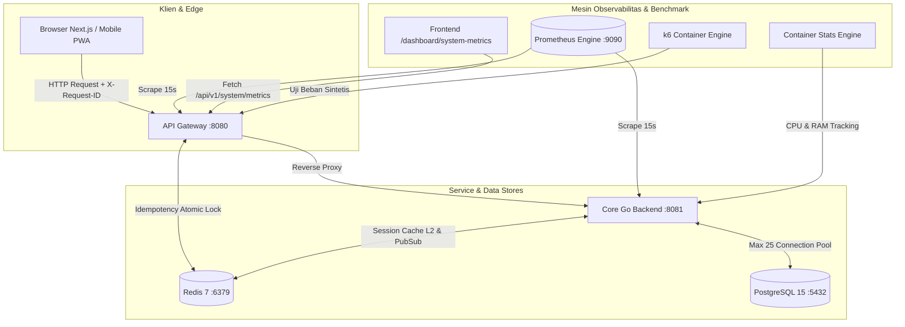

# Analisis Mendalam Metrik Telemetri, Hasil Uji Beban k6 & Panduan Observabilitas Sistem
**PT. Adijayantara Logistics Indonesia — Sistem Manajemen Kas Operasional & Pengiriman Armada**

---

## 1. Pendahuluan & Filosofi Observabilitas

Sistem operasional dan pencatatan kas PT. Adijayantara Logistics mengadopsi standar **Google SRE (Site Reliability Engineering) Golden Signals** yang diintegrasikan langsung ke dalam arsitektur aplikasi (In-App Custom Observability). 

Observabilitas bukan sekadar menampilkan grafik, melainkan memberikan kemampuan bagi Admin IT dan Manajemen Rekayasa Perangkat Lunak untuk:
1. **Memahami Kesehatan Internal**: Mengetahui kondisi komputasi CPU, RAM, Goroutine, dan Connection Pool database secara instan tanpa perlu masuk ke konsol server Linux (*SSH-less Monitoring*).
2. **Mendeteksi Masalah Sebelum User Mengeluh (*Proactive Alerting*)**: Mengidentifikasi antrean query dan degradasi latensi respons sebelum mengganggu operasional pengiriman armada di lapangan.
3. **Menguji Ketahanan Secara Mandiri (*Self-Service Chaos & Load Testing*)**: Menyediakan mesin pengujian beban k6 otomatis terintegrasi untuk memverifikasi kesiapan sistem menghadapi lonjakan transaksi.



---

## 2. Bedah Mendalam Panel Metrik Dashboard (`/dashboard/system-metrics`)

Menu **Telemetri & Observabilitas Sistem** menyajikan 5 panel komponen utama. Berikut adalah cara membaca, makna di balik angka, dan interpretasi teknisnya:

---

### Panel 1: Frontline Gateway Golden Signals (Top KPI Cards)

Panel paling atas menampilkan performa gerbang utama (API Gateway) yang menerima seluruh lalu lintas dari staf lapangan dan kantor pusat.

```
┌─────────────────────────┬─────────────────────────┬─────────────────────────┬─────────────────────────┐
│  GATEWAY THROUGHPUT     │  P95 REQUEST LATENCY    │  HTTP ERROR RATE        │  IDEMPOTENCY GUARD      │
│  48.3 RPS               │  3.8 ms                 │  0.00%                  │  14 Hits                │
│  Lalu lintas request/dtk │  95% request di bawah   │  Persentase kegagalan   │  Submit ganda dicegah   │
└─────────────────────────┴─────────────────────────┴─────────────────────────┴─────────────────────────┘
```

#### 1. Gateway Throughput (RPS - Requests Per Second)
- **Sumber Metrik**: `rate(gateway_http_requests_total[1m])` via Prometheus.
- **Cara Membaca**: Menunjukkan rata-rata frekuensi panggilan API yang masuk ke sistem per detik.
- **Makna & Ambang Batas**:
  - **$< 10\text{ RPS}$ (Normal/Rendah)**: Lalu lintas wajar operasional harian.
  - **$10 - 50\text{ RPS}$ (Jam Sibuk)**: Pergantian shift sopir, input serentak surat jalan, atau penagihan invoice massal.
  - **$> 100\text{ RPS}$ (Lonjakan/Stress)**: Beban sangat tinggi atau sedang berlangsung pengujian beban sintetis k6.

#### 2. P95 Request Latency (Quantile 0.95)
- **Sumber Metrik**: `histogram_quantile(0.95, sum(rate(gateway_http_request_duration_seconds_bucket[1m])) by (le))`
- **Mengapa Menggunakan P95, Bukan Rata-Rata (*Average*)?**
  > [!IMPORTANT]
  > **Rata-rata (*Average/Mean*) Sering Menipu**: Jika dari 100 request ada 99 request yang selesai dalam waktu 2 ms, dan ada 1 request yang macet selama 1.000 ms, nilai rata-ratanya adalah $\approx 12\text{ ms}$. Angka 12 ms terlihat "bagus", padahal ada 1 pengguna yang mengalami freeze 1 detik penuh.  
  > **P95 Menjamin Kualitas Riil**: P95 menjamin bahwa **95% dari seluruh pengguna** merasakan respons sistem di bawah angka tersebut.
- **Ambang Batas**:
  - 🟢 **Sangat Baik**: $< 50\text{ ms}$.
  - 🟡 **Waspada**: $100\text{ ms} - 300\text{ ms}$.
  - 🔴 **Kritis**: $> 500\text{ ms}$ (indikasi query database lambat atau lock contention).

#### 3. HTTP Error Rate (%)
- **Sumber Metrik**: Persentase request berstatus kode HTTP $\ge 400$ (termasuk 500 Internal Error dan 502 Bad Gateway).
- **Cara Membaca**:
  - **$0.00\%$**: Kondisi ideal. Semua request berhasil dilayani.
  - **$< 1.00\%$**: Wajar jika berasal dari salah input form/validasi pengguna (HTTP 400 / 422).
  - **$> 2.00\%$**: Perlu investigasi. Jika muncul error `502 Bad Gateway`, artinya API Gateway aktif namun service backend Core Go mengalami crash/mati.

#### 4. Idempotency Guard (Hits)
- **Sumber Metrik**: `gateway_idempotency_hits_total`
- **Cara Membaca**: Jumlah request mutasi data (`POST`, `PUT`, `PATCH`) ganda yang berhasil **ditangkis secara atomik oleh Redis lock** (`X-Idempotency-Key`).
- **Makna**: Setiap angka di kartu ini membuktikan bahwa sistem **berhasil menggagalkan duplikasi saldo kas, dobel pencatatan pengiriman, atau pembuatan invoice ganda** yang disebabkan oleh klik ganda (*double click*) user atau retry otomatis koneksi internet yang tidak stabil.

---

### Panel 2: Database Connection Pool (PostgreSQL 15) & Container Health

Database adalah komponen paling vital dalam integritas keuangan dan operasional. Panel ini memadukan status internal pool Go dengan kesehatan container Docker/Podman:

```
┌─────────────────────────────────────────────────────────────────────────────────────────────────────────┐
│ Database Connection Pool (PostgreSQL 15)                                            [ Maks 25 Koneksi ] │
│ Utilisasi Pool: 32% In-Use                                   8 aktif / 17 idle / 25 max koneksi         │
│ [████████████░░░░░░░░░░░░░░░░░░░░░░░░░░░░░░░░░░░░░░░░░░░░░░░░░░░░░░░░░░░░░░░░░░░░░░░░░░░░░░░░░░░░░░░░░] │
│ ● In Use (8)  ● Idle / Siap Pakai (17)                                                  Pool Limit: 25   │
├─────────────────────────┬─────────────────────────┬─────────────────────────┬───────────────────────────┤
│  WAIT COUNT             │  WAIT DURATION          │  POSTGRES CPU           │  POSTGRES RAM             │
│  0                      │  0.0 ms                 │  6.38%                  │  35.86 MB                 │
│  Tanpa antrean          │  Latensi antrean        │  Beban container DB     │  11 threads               │
└─────────────────────────┴─────────────────────────┴─────────────────────────┴───────────────────────────┘
```

#### 1. Pembagian Status Koneksi (In-Use vs Idle vs Max Open)
- **In-Use (Ungu)**: Jumlah koneksi yang detik ini sedang sibuk mengeksekusi instruksi SQL (`SELECT`, `INSERT`, `UPDATE`, `BEGIN/COMMIT`). Begitu query selesai, koneksi langsung dilepas kembali ke pool.
- **Idle (Biru Muda)**: Koneksi TCP ke PostgreSQL yang sudah terbuka dan dalam keadaan siap pakai (*warm*). Aplikasi tidak perlu melakukan proses *handshake* TCP baru yang memakan waktu $\approx 10-20\text{ ms}$.
- **Maks 25 Koneksi**: Plafon batas atas yang diizinkan untuk dibuka oleh Core Go Backend.

> [!NOTE]
> **Mengapa Batas Koneksi Default Adalah 25?**  
> Berbeda dengan MySQL yang memakai *thread-based model*, arsitektur **PostgreSQL menggunakan process-forking model** (setiap 1 koneksi klien melahirkan 1 proses sistem operasi baru di Linux). Setiap proses backend PostgreSQL mengonsumsi $5 - 10\text{ MB}$ RAM dan memerlukan *context switching* CPU.  
> Untuk server skala UMKM/menengah dengan 2-4 core CPU, batas **25 koneksi pool** mampu melayani hingga $500 - 1.000\text{ request/detik}$ jika query dieksekusi dengan cepat ($< 5\text{ ms}$). Membuka ratusan koneksi justru akan memperlambat database akibat perebutan CPU cache dan I/O disk.

#### 2. Wait Count & Wait Duration (Antrean Pool)
- **Wait Count**: Akumulasi jumlah permintaan koneksi dari goroutine yang **terpaksa mengantre (tertahan)** karena seluruh 25 slot koneksi sedang penuh terpakai.
  - **Nilai Ideal = 0**: Berarti kapasitas pool selalu memadai; tidak ada request yang tertunda.
  - **Jika Bertambah $> 0$**: Menandakan terjadi *connection starvation*. Request harus menunggu koneksi lain selesai mengeksekusi query.
- **Wait Duration**: Total durasi waktu tunggu antrean (dalam milidetik). Jika nilai ini tinggi ($> 100\text{ ms}$), pengguna akan merasakan aplikasi melambat drastis.

#### 3. Postgres CPU & RAM (Container Metrics)
- Diambil secara non-blocking dari runtime container (`podman stats` / `docker stats`) dengan caching internal 3 detik:
  - **CPU $\le 15\%$**: Database beroperasi sangat santai.
  - **CPU $15\% - 50\%$**: Database sedang melayani query berat atau pengujian beban.
  - **CPU $> 70\%$**: Waspada! Terjadi query tanpa indeks (*full table scan*) atau lonjakan transaksi ekstrem.
  - **RAM ($35 - 80\text{ MB}$)**: Konsumsi memori sangat hemat dan stabil (PostgreSQL 15 Alpine).

---

### Panel 3: Business KPI Activity (Denyut Operasional Riil)

Menghubungkan metrik infrastruktur teknis dengan aktivitas fisik di gudang dan lapangan:
1. **Pengiriman (Shipment)**: Total transaksi muatan armada yang tercatat hari ini.
2. **Top Up Kas Masuk**: Frekuensi pengisian kas operasional untuk uang jalan sopir/armada hari ini.
3. **Invoice Diterbitkan**: Jumlah berkas tagihan piutang customer yang dibuat hari ini.
4. **Invoice Lunas**: Jumlah invoice yang berhasil diselesaikan/dilunasi pembayarannya hari ini.

> [!TIP]
> **Teknik Analisis Korelasi (*Cross-Correlation Analysis*)**:  
> Jika *Gateway Throughput* mendadak tinggi ($> 80\text{ RPS}$) namun angka *Business KPI Activity* tidak bertambah sama sekali di jam kerja, waspadai adanya aktivitas mencurigakan: bot scraping, brute-force login, atau error pada frontend yang menyebabkan pengguna melakukan reload berkali-kali.

---

### Panel 4: Host Runtime Go & Cache Infrastructure

Panel inspeksi jeroan mesin runtime bahasa Go dan distributed in-memory cache Redis:

| Metrik | Nilai Normal | Interpretasi & Tindakan Jika Abnormal |
| :--- | :--- | :--- |
| **Heap Memory (Alloc MB)** | $15 - 45\text{ MB}$ | Jumlah RAM riil yang sedang digunakan oleh struktur data Go. Jika terus naik tanpa pernah turun setelah GC, ada indikasi kebocoran memori (*memory leak*). |
| **OS Sys Memory (Sys MB)** | $30 - 80\text{ MB}$ | Total memori yang dialokasikan OS Linux untuk proses Go. |
| **Active Goroutines** | $30 - 100$ | Jumlah thread virtual Go yang aktif. Pada saat idle bernilai puluhan. Jika angka ini melonjak ke ribuan ($> 1.000$) dan tidak kembali turun, terjadi *goroutine leak* (misalnya ada channel/HTTP client yang menggantung tanpa timeout). |
| **GC Runs (Total)** | Naik berkala | Frekuensi pembersihan memori otomatis. Go Garbage Collector didesain dengan jeda sub-milidetik ($< 1\text{ ms}$). |
| **Service Uptime** | Durasi aktif | Memastikan service stabil dan tidak mengalami restart diam-diam (*crash loop*). |
| **Redis Status & Ping** | `CONNECTED` ($< 1.0\text{ ms}$) | Redis bertugas melayani sesi pengguna dan *idempotency lock*. Waktu respons wajib di bawah 1 milidetik. |

---

### Panel 5: Slow Query Inspector (Tabel Log Query Lambat)

- **Ambang Batas (Threshold)**: Ditetapkan pada **$100\text{ ms}$**.
- **In-Memory Ring-Buffer**: Menyimpan hingga 20 query terakhir yang paling lambat secara *circular* di RAM Go (tanpa beban write ke disk).
- **Cara Membaca Tabel**:
  - Periksa kolom **Repository** dan **Operasi** untuk mengetahui modul yang mengalami kelambatan.
  - Periksa **Cuplikan Query**: Apakah terdapat klausa `WHERE` yang belum ter-index, operasi `JOIN` tanpa filter tanggal, atau fungsi agregasi pada tabel besar.
- **Tombol "Uji Query Lambat (150ms)"**: Digunakan oleh Admin untuk memverifikasi apakah pipeline telemetri, alert ring-buffer, dan pencatatan metrik bekerja secara *live*.

---

## 3. Panduan Pengujian Beban k6 (Self-Service Performance Benchmark)

Menu benchmark menyediakan 6 skenario pengujian beban sintetis yang dikelompokkan ke dalam **2 Zona Keamanan**:

```
┌────────────────────────────────────────────────────────────────────────────────────────┐
│  ZONA A: PENGUJIAN RUTIN & AMAN (1-KLIK)                                               │
│  [ Smoke Test (5 VUs, 5s) ]  [ Average Load (50 VUs, 20s) ]  [ Idempotency (30 VUs, 3s) ]│
├────────────────────────────────────────────────────────────────────────────────────────┤
│  ZONA B: PENGUJIAN BEBAN BERAT & STRESS (WAJIB KONFIRMASI KEAMANAN)                   │
│  [ Heavy Stress (200 VUs) ]  [ Spike Test (160 VUs) ]        [ Soak Test (30 VUs, 60s) ]│
└────────────────────────────────────────────────────────────────────────────────────────┘
```

### Detail 6 Skenario Pengujian

#### 1. Smoke Test (5 VUs, Durasi 5 Detik) — *Zona A*
- **Tujuan**: *Sanity check* kilat untuk memastikan semua endpoint inti (`/health`, `/cashflow`, `/invoices`) hidup dan merespons dengan benar.
- **Waktu Eksekusi yang Tepat**: Sesaat setelah deploy rilis baru atau restart server.

#### 2. Average Load Test (50 VUs, Durasi 20 Detik) — *Zona A*
- **Profil Beban**: Ramp up 4s ke 50 VUs $\rightarrow$ Steady 12s $\rightarrow$ Ramp down 4s.
- **Tujuan**: Mensimulasikan jam kerja sibuk harian normal di mana puluhan staf kasir, admin gudang, dan pimpinan mengakses aplikasi secara bersamaan.
- **Ekspektasi**: P95 Latency $< 50\text{ ms}$, Error Rate $0.00\%$, Utilisasi DB Pool $< 80\%$.

#### 3. Idempotency Burst Concurrency (30 VUs, Durasi 3 Detik) — *Zona A*
- **Tujuan**: Menembakkan puluhan request mutasi dengan ID transaksi yang sama secara bersamaan persis dalam hitungan milidetik.
- **Ekspektasi**: Tepat **1 request yang berstatus HTTP 200/201 (sukses)**, dan seluruh 29 request lainnya harus **ditolak secara aman dengan HTTP 409 Conflict / 400 Bad Request** oleh Redis atomic lock.

#### 4. Heavy Stress Test (200 VUs, Durasi 35 Detik) — *Zona B*
- **Profil Beban**: 50 VUs $\rightarrow$ 120 VUs $\rightarrow$ Puncak 200 VUs (step-up).
- **Tujuan**: Mencari titik patah (*breaking point*) kapasitas sistem dan membuktikan stabilitas antrean Connection Pool database saat kelebihan beban 8x lipat kapasitas pool normal.

#### 5. Spike Test (160 VUs Instan, Durasi 12 Detik) — *Zona B*
- **Profil Beban**: Dari 0 langsung melonjak ke 160 VUs dalam 2 detik, bertahan 6 detik, lalu turun ke 0.
- **Tujuan**: Mensimulasikan lonjakan mendadak (*flash crowd*) dan menguji kemampuan *auto-recovery* sistem tanpa terjadinya crash atau memory leak.

#### 6. Soak Test / Endurance Test (30 VUs Konstan, Durasi 60 Detik) — *Zona B*
- **Tujuan**: Menjalankan beban konstan berdurasi panjang untuk mendeteksi apakah terjadi kebocoran koneksi database (*unclosed connection*) atau kenaikan RAM Go yang tidak mau turun (*memory leak*).

---

## 4. Cara Membaca Hasil Pengujian Beban (Benchmark Result Modal & Download .md)

Ketika pengujian beban k6 selesai, sistem menampilkan modal hasil lengkap dan menyediakan tombol unduh berkas Markdown (`.md`). Berikut adalah panduan membaca setiap bagian:

---

### Bagian A: Status Keseluruhan (Simpulan Eksekutif)

Sistem secara otomatis mengevaluasi hasil menggunakan algoritma keputusan standar SRE:

| Badge Status | Kriteria Evaluasi | Makna Operasional |
| :--- | :--- | :--- |
| 🟢 **EXCELLENT** | Sukses $\ge 99.0\%$ dan P95 Latency $< 100\text{ ms}$ | **Sistem Prima & Sangat Responsif**. Sistem memiliki *headroom* kapasitas yang sangat longgar. |
| 🔵 **GOOD** | Sukses $\ge 98.0\%$ dan P95 Latency $< 300\text{ ms}$ | **Sistem Sehat & Siap Operasional**. Sistem bekerja dengan baik pada beban kerja target. |
| 🟡 **WARNING** | Sukses $90.0\% - 98.0\%$ atau P95 $300 - 800\text{ ms}$ | **Beban Mendekati Batas**. Latensi mulai membengkak; periksa efisiensi query. |
| 🔴 **CRITICAL** | Sukses $< 90.0\%$ atau P95 $> 800\text{ ms}$ | **Sistem Saturasi / Mengalami Bottleneck**. Ditemukan request gagal atau antrean parah. |

---

### Bagian B: Analisis Dampak Database PostgreSQL Selama Uji Beban

Bagian ini merupakan hasil inovasi kustom yang menghubungkan performa aplikasi dengan kondisi riil database PostgreSQL:

```
┌────────────────────────────────────────────────────────────────────────────────────────┐
│ [DB] Analisis Dampak Database PostgreSQL Selama Uji Beban               [ 🟢 SEHAT ]   │
│ Observasi pool koneksi, waktu tunggu antrian, dan performa database                    │
├─────────────────────────┬─────────────────────────┬─────────────────────────┬──────────┤
│ PUNCAK KONEKSI DIGUNAKAN│ ANTRIAN KONEKSI TERJADI │ TOTAL WAKTU TUNGGU      │ SLOW QUERY│
│ 18 / 25 (72%)           │ +0 request              │ 0.0 ms                  │ 0 query  │
│ Beban puncak aktif      │ Tanpa antrian tertahan  │ Akumulasi latensi antrean│ Ambang >100ms│
├─────────────────────────┴─────────────────────────┴─────────────────────────┴──────────┤
│ 💡 Rekomendasi Kapasitas DB:                                                          │
│ Kapasitas pool 25 koneksi sangat memadai. Tidak terjadi antrean maupun slow query.     │
└────────────────────────────────────────────────────────────────────────────────────────┘
```

#### Studi Kasus Teknis: Mengapa Sebelumnya Muncul Angka "144 / 25" dan Status BOTTLENECK?
Pada pengujian sebelumnya, muncul tampilan:
- **Puncak Koneksi Digunakan: 144 / 25 (100%)**
- **Antrian Koneksi Terjadi: +0 request**
- **Status Database: 🔴 BOTTLENECK**

> [!CAUTION]
> **Penyebab Teknis di Balik Kejadian Tersebut:**  
> 1. **Default Driver Go Tanpa Batas**: Pada kode awal `NewDBPool`, fungsi `db.SetMaxOpenConns(25)` belum diset secara eksplisit. Standar library Go memiliki default `MaxOpen = 0 (UNLIMITED)`.  
> 2. **Go Membuka 144 Koneksi Paralel**: Saat stress test 200 VUs berjalan, Go tidak membatasi koneksi pada 25, melainkan membuka hingga 144 koneksi TCP langsung ke PostgreSQL.  
> 3. **Mengapa Antrean Tetap 0?**: Karena Go tidak dibatasi di 25, Go tidak pernah menahan request; setiap ada request baru, Go langsung membuat koneksi baru. Akibatnya, `Wait Count` tetap 0.  
> 4. **Mengapa BOTTLENECK?**: Karena $144 > 25$, utilisasi terhitung $\ge 100\%$, ditambah **20 Slow Query** muncul akibat PostgreSQL kebanjiran 144 koneksi bersamaan.  
> 
> **Solusi yang Telah Diterapkan:**  
> Kode `internal/adapters/repository/db.go` kini telah dilengkapi konfigurasi wajib:
> ```go
> db.SetMaxOpenConns(25)                  // Batas keras maksimum 25 koneksi
> db.SetMaxIdleConns(10)                  // 10 koneksi idle siap pakai
> db.SetConnMaxLifetime(15 * time.Minute) // Daur ulang koneksi lama
> db.SetConnMaxIdleTime(5 * time.Minute)
> ```
> Kini koneksi aktif akan tertahan rapi di maksimal 25 koneksi, dan kelebihan request akan mengantre secara tertib di memori Go.

---

### Bagian C: Distribusi Latensi Respons (Quantiles)

| Metrik | Makna Teknis | Target SLO |
| :--- | :--- | :--- |
| **Min** | Waktu tercepat respons sistem (biasanya rute statis atau cache hit). | $< 2\text{ ms}$ |
| **P50 (Median)** | Tepat 50% pengguna menikmati kecepatan di bawah angka ini. | $< 10\text{ ms}$ |
| **Average (Mean)** | Rata-rata durasi keseluruhan. | $< 20\text{ ms}$ |
| **P90** | 90% pengguna berada di bawah angka ini. | $< 35\text{ ms}$ |
| **P95** | Standard baku industri web modern (95% pengguna). | $< 50\text{ ms}$ |
| **P99** | *Worst-case scenario* untuk 1% pengguna paling lambat. | $< 150\text{ ms}$ |
| **Max** | Request paling lambat yang pernah dicatat selama pengujian. | $< 500\text{ ms}$ |

---

## 5. Matriks Saran, Rekomendasi Tindakan & Mitigasi Admin IT

Gunakan tabel panduan berikut untuk menentukan tindakan pemeliharaan berdasarkan hasil pembacaan telemetri dan benchmark:

### Kasus 1: Status EXCELLENT / SEHAT (Utilisasi DB $< 80\%$, Error $0\%$)
- **Kondisi**: Sistem bekerja dalam kapasitas optimal.
- **Saran Tindakan**:
  - Pertahankan konfigurasi saat ini (`max_open = 25`).
  - Lakukan pengujian *Average Load Test* rutin seminggu sekali untuk memverifikasi tidak ada degradasi kode baru.

### Kasus 2: Status WASPADA (Utilisasi DB $80\% - 95\%$ atau Antrean Kecil $+1$ s/d $+15$)
- **Kondisi**: Beban mulai mendekati kapasitas batas pool, namun sistem masih mampu menyelesaikan request tanpa error.
- **Saran Tindakan**:
  1. Periksa panel **Slow Query Inspector**: cari query yang memakan waktu $> 100\text{ ms}$.
  2. Tambahkan **Composite Index** pada tabel yang sering di-filter, misalnya:
     ```sql
     CREATE INDEX idx_cashflow_entry_date ON cashflow_entries (entry_type, date_of_entry);
     CREATE INDEX idx_invoices_status_date ON invoices (status, created_at) WHERE deleted_at IS NULL;
     ```
  3. Hindari operasi `SELECT *` pada tabel dengan kolom teks panjang jika tidak diperlukan.

### Kasus 3: Status BOTTLENECK (Antrean $> 20$ request atau Wait Duration $> 200\text{ ms}$)
- **Kondisi**: Permintaan transaksi mengantre lama karena slot koneksi 25 penuh terpakai.
- **Saran Tindakan & Analisa Kapasitas**:
  - Pertimbangkan untuk **menaikkan Connection Pool dari 25 ke 50**.
  - **Kalkulasi Kebutuhan Memori**:
    $$\text{Tambahan RAM DB} = 25 \times 10\text{ MB} = 250\text{ MB RAM}$$
  - **Langkah Perubahan**:
    1. Buka file [`internal/adapters/repository/db.go`](file:///home/aliube/Workspace/Adi/cashflow-shipment-app/services/core-go/internal/adapters/repository/db.go).
    2. Ubah `db.SetMaxOpenConns(25)` menjadi `db.SetMaxOpenConns(50)` dan `SetMaxIdleConns(20)`.
    3. Pastikan parameter PostgreSQL di `postgresql.conf` memiliki `max_connections >= 100`.
    4. Jalankan ulang *Heavy Stress Test (200 VUs)* untuk memverifikasi antrean hilang.

### Kasus 4: Error Rate Meningkat ($> 2\%$) atau Muncul HTTP 502 Bad Gateway
- **Kondisi**: Gateway kehilangan koneksi dengan backend Core Go.
- **Saran Tindakan Darurat**:
  1. Klik tombol **Emergency Abort** jika pengujian beban sedang berlangsung.
  2. Cek apakah terjadi *Out Of Memory (OOM)* pada container Go:
     ```bash
     docker inspect cashflow_core_go --format='{{.State.OOMKilled}}'
     ```
  3. Periksa log error transaksi database:
     ```bash
     docker logs --tail 100 cashflow_core_go
     ```

### Kasus 5: Goroutine Meningkat Tajam ($> 500$ dan Tidak Turun)
- **Kondisi**: Indikasi kuat terjadinya *Goroutine Leak*.
- **Saran Tindakan**:
  1. Periksa pemanggilan HTTP client eksternal: pastikan selalu menggunakan `http.Client{Timeout: 10 * time.Second}`.
  2. Periksa transaksi database: pastikan setiap `tx, err := db.Beginx()` selalu diakhiri dengan `defer tx.Rollback()` sebelum `tx.Commit()`.

---

## 6. Ringkasan Tindakan Cepat (IT Admin Quick Runbook)

| Pertanyaan / Gejala | Jawaban Singkat / Cara Mengatasinya |
| :--- | :--- |
| **Kapan harus menaikkan pool database ke 50?** | Saat *Average Load Test (50 VUs)* memicu `Wait Count > 10` atau utilisasi pool konsisten di atas $90\%$. |
| **Apakah Wait Count = 0 itu bagus?** | **Sangat bagus**. Artinya tidak ada satupun query yang harus mengantre menunggu giliran koneksi. |
| **Mengapa tombol Uji Query Lambat (150ms) penting?** | Untuk memastikan mekanisme pencatatan ring buffer dan alarm threshold bekerja tanpa harus menunggu insiden sungguhan di produksi. |
| **Bagaimana cara menghentikan uji beban yang macet?** | Tekan tombol merah **Emergency Abort** pada banner aktif di atas dashboard. Sistem akan membunuh proses k6 dalam $< 500\text{ ms}$. |
| **Di mana laporan benchmark tersimpan?** | Tersimpan di memori cache rolling (maks 10 riwayat terakhir) dan file fisik tersimpan otomatis di direktori `tests/k6/reports/`. |

---
*Dokumen ini diterbitkan oleh Tim Rekayasa Antigravity sebagai buku panduan operasional resmi sistem PT. Adijayantara Logistics Indonesia.*
