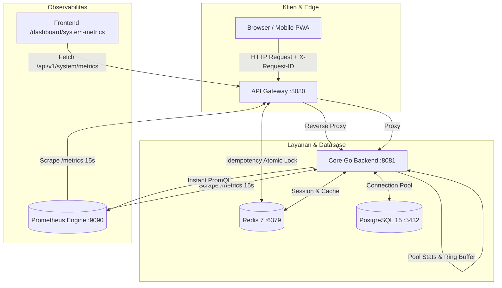

# Panduan Telemetri, Observabilitas Sistem & Incident Runbook
**PT. Adijayantara Logistics Indonesia — Sistem Manajemen Kas Operasional & Pengiriman Armada**

---

## 1. Pendahuluan & Filosofi Observabilitas

Sistem kas operasional dan logistik PT. Adijayantara mengadopsi standar **Observabilitas Modern (Google SRE Best Practices)** yang menggabungkan dua dimensi penting:
1. **Telemetri Teknis Infrastruktur (*Golden Signals*)**: Mengukur kesehatan server, keandalan edge gateway, throughput per detik, latency, kapasitas connection pool database, dan efisiensi memori runtime.
2. **Telemetri Berdampak Bisnis (*Business-Impact Telemetry*)**: Menghubungkan metrik teknis dengan denyut operasional riil (pengiriman muatan, perputaran kas sopir/armada, dan penerbitan piutang invoice) secara langsung tanpa *delay*.

Arsitektur telemetri ini didesain menggunakan **Opsi B (Prometheus Time-Series Engine terintegrasi langsung dengan Frontend Custom Dashboard)** pada rute `/dashboard/system-metrics`, sehingga tim IT Super Admin tidak bergantung pada aplikasi pihak ketiga yang berat (seperti Grafana) dan memiliki visualisasi kustom yang ringan, responsif, dan terintegrasi dengan sistem izin PBAC.



---

## 2. Panduan Membaca Widget Dashboard

Halaman **Telemetri & Metrik** (`/dashboard/system-metrics`) terbagi menjadi 5 panel utama:

### Panel 1: Top KPI Cards (Indikator Utama Frontline Gateway)

| Nama Kartu | Sumber Data | Cara Membaca & Makna Nilai |
| :--- | :--- | :--- |
| **Gateway Throughput (RPS)** | `gateway_http_requests_total` (PromQL `rate[1m]`) | Menunjukkan rata-rata jumlah request per detik yang diterima edge gateway. Nilai ini menggambarkan intensitas beban kerja sistem saat ini. |
| **P95 Request Latency** | `gateway_http_request_duration_seconds` (Histogram Quantile 0.95) | **95% dari seluruh request** selesai lebih cepat dari angka ini. Jika P95 = 45 ms, artinya hanya 5% request yang membutuhkan waktu di atas 45 ms. Ini jauh lebih akurat daripada rata-rata (*mean*) yang sering menipu. |
| **HTTP Error Rate** | `gateway_http_errors_total` / Requests Total $\times 100$ | Persentase kegagalan request (status HTTP $\ge 400$, termasuk error `502 Bad Gateway`). Idealnya adalah **0.00%**. |
| **Idempotency Guard** | `gateway_idempotency_hits_total` | Jumlah request mutasi data (POST/PUT/PATCH) ganda yang **berhasil ditangkis oleh Redis lock**. Angka ini membuktikan bahwa sistem berhasil mencegah *double-entry* transaksi kas atau muatan. |

---

### Panel 2: Database Connection Pool (PostgreSQL 15)

Database adalah jantung integritas finansial kas dan piutang. Panel ini memantau kapasitas koneksi `*sqlx.DB`:

- **Bar Visual Kapasitas**:
  - **Ungu (*In Use*)**: Jumlah koneksi yang sedang aktif mengeksekusi query SQL pada detik ini.
  - **Biru Muda (*Idle*)**: Koneksi yang telah terbuka dan siap digunakan seketika tanpa perlu proses *handshake* baru.
  - **Abu-abu (*Kapasitas Tersedia*)**: Sisa kuota koneksi sebelum mencapai batas maksimum (`max_open`, default: 25).
- **Wait Count (Antrian Pool)**:
  - Jumlah total permintaan koneksi yang harus mengantre/menunggu karena seluruh koneksi sedang dipakai. **Nilai optimal harus selalu 0**. Jika nilai ini bertambah, terjadi *connection pool bottleneck*.
- **Wait Duration**:
  - Waktu tunggu rata-rata (dalam milidetik) yang dihabiskan thread aplikasi untuk mendapatkan koneksi DB saat pool penuh.

---

### Panel 3: Business KPI Activity (Hari Ini)

Panel ini memastikan sistem komputerisasi melayani operasional logistik secara nyata pada tanggal hari ini:

1. **Pengiriman (Shipment)**: Total transaksi muatan armada logistik hari ini.
2. **Top Up Kas Masuk**: Frekuensi suntikan dana kas operasional sopir/armada yang masuk buku kas hari ini.
3. **Invoice Diterbitkan**: Jumlah dokumen penagihan piutang customer yang berhasil dibuat hari ini.
4. **Invoice Lunas**: Jumlah tagihan yang berhasil dilunasi customer hari ini.

> [!TIP]
> **Korelasi Cerdas**: Jika *Throughput RPS* tinggi tetapi angka transaksi bisnis hari ini bernilai 0 di jam kerja sibuk, admin IT harus waspada terhadap potensi *silent error* (misal: user kesulitan login atau form gagal submit).

---

### Panel 4: Host Runtime & Cache Infrastructure

Panel diagnostik mendalam untuk memantau mesin bahasa Go dan Redis:

- **Heap Memory (Alloc MB)**: Memori RAM aktif yang dialokasikan oleh aplikasi Go.
- **OS Sys Memory (Sys MB)**: Total memori virtual yang diminta proses Go dari sistem operasi Linux.
- **Active Goroutines**: Jumlah thread ringan Go yang sedang berjalan. Pada beban normal bernilai puluhan ($30 - 80$). Jika angka ini melonjak hingga ribuan tanpa penurunan, terindikasi *goroutine leak*.
- **GC Runs (Total)**: Frekuensi siklus pembersihan memori otomatis (*Garbage Collector*).
- **Service Uptime**: Durasi server Core Go telah aktif berjalan sejak restart terakhir.
- **Redis Cache Status & Ping Latency**: Status konektivitas Redis (harus `CONNECTED`) dengan latency respons $\le 1\text{ ms}$ untuk memastikan *distributed lock* dan *session store* super cepat.

---

### Panel 5: Slow Query Inspector (Tabel Log Query Lambat)

Menampilkan *in-memory ring-buffer* dari **20 query terlama terakhir** yang durasi eksekusinya melewati batas $\ge 100\text{ ms}$:

- **Badge Durasi**:
  - <span style="color:#10B981; font-weight:bold;">Hijau (&lt; 100 ms)</span>: Performa optimal.
  - <span style="color:#F59E0B; font-weight:bold;">Kuning / Oranye (100 - 300 ms)</span>: Query sedang, perlu diperhatikan jika volume data membesar.
  - <span style="color:#EF4444; font-weight:bold;">Merah (&gt; 300 ms)</span>: Query lambat kritis, wajib dievaluasi indexing atau strukturnya.
- **Kolom Tabel**: Waktu kejadian, Repository target (`cashflow_repo`, `invoice_repo`, dll), Nama operasi, Cuplikan query SQL, dan Status keberhasilan.
- **Tombol "Uji Query Lambat (150ms)"**: Tombol simulasi pengujian untuk memverifikasi apakah inspector dan alarm berfungsi secara *live*.

---

## 3. Matriks Ambang Batas Kesehatan Sistem (SLO)

Admin IT wajib mengacu pada matriks Service Level Objectives (SLO) berikut dalam menentukan status operasional:

| Komponen Metrik | Kondisi Normal (Hijau) | Kondisi Waspada (Kuning) | Kondisi Kritis / Bahaya (Merah) |
| :--- | :--- | :--- | :--- |
| **P95 Latency** | $< 100\text{ ms}$ | $100\text{ ms} - 300\text{ ms}$ | $> 500\text{ ms}$ secara konsisten |
| **HTTP Error Rate** | $0.00\%$ | $0.50\% - 2.00\%$ | $> 5.00\%$ atau muncul error `502` |
| **DB Pool Usage** | $< 60\%$ kapasitas | $60\% - 80\%$ kapasitas | $> 85\%$ kapasitas atau `Wait Count > 0` |
| **DB Pool Wait Count** | Selalu $0$ | $1 - 5$ antrian sesaat | $> 10$ antrian berkelanjutan |
| **Redis Ping Latency** | $< 1.0\text{ ms}$ | $1.0\text{ ms} - 5.0\text{ ms}$ | $> 10\text{ ms}$ atau `DISCONNECTED` |
| **Slow Queries** | $0$ query baru / jam | $1 - 5$ query ($100-300\text{ ms}$) | $> 5$ query $(> 300\text{ ms})$ / jam |
| **Active Goroutines** | $< 150$ goroutines | $150 - 500$ goroutines | $> 1.000$ goroutines (indikasi *leak*) |
| **Idempotency Hits** | Berfluktuasi wajar | Lonjakan puluhan hits/menit | Ratusan hits/menit (*retry storm*) |

---

## 4. Prosedur Tanggap Darurat & Langkah Admin IT (SOP)

### SOP 1: Penanganan Lonjakan Error Rate (> 5%) atau 502 Bad Gateway

1. **Identifikasi Titik Masalah**:
   - Jika halaman menampilkan pesan `502 Bad Gateway` atau `Layanan backend downstream sedang tidak dapat dijangkau`, artinya API Gateway (`:8080`) aktif tetapi Core Go Backend (`:8081`) mati atau tidak merespons.
2. **Langkah Investigasi**:
   ```bash
   # Periksa status port lokal
   ss -tulpn | grep -E '8080|8081'

   # Periksa log service Core Go
   make infra-logs
   ```
3. **Tindakan Pemulihan**:
   - Jika Core Go mati mendadak karena panic/OOM, periksa error log terakhir pada terminal atau container, lalu restart service:
     ```bash
     # Jika di container
     docker-compose restart core-go

     # Jika di host OS
     make run-local-all-go
     ```

---

### SOP 2: Penanganan Connection Pool Exhaustion (Pool Penuh & Wait Count > 0)

1. **Gejala**:
   - Bar kapasitas pool menunjukkan angka $25/25$ koneksi *In Use*.
   - Nilai *Wait Count* terus bertambah dan *Wait Duration* naik di atas $100\text{ ms}$.
   - Klien mengalami loading lama pada halaman transaksi atau invoice.
2. **Penyebab Umum**:
   - Terdapat transaksi database (`tx := db.BeginTxx()`) yang tidak memiliki `defer tx.Rollback()`.
   - Terjadi *table lock contention* akibat query update massal yang belum selesai.
3. **Langkah Mitigasi di PostgreSQL**:
   ```bash
   # Masuk ke container PostgreSQL dan periksa query yang sedang mengunci:
   docker-compose exec postgres psql -U cashflow_user -d cashflow_db -c \
   "SELECT pid, age(clock_timestamp(), query_start), usename, state, query 
    FROM pg_stat_activity 
    WHERE state != 'idle' AND query NOT ILIKE '%pg_stat_activity%' 
    ORDER BY query_start ASC;"
   ```
4. **Tindakan**:
   - Hentikan paksa PID query yang menggantung jika memblokir sistem:
     ```sql
     SELECT pg_terminate_backend(<PID_TERPILIH>);
     ```
   - Jika sistem mengalami peningkatan volume transaksi permanen karena penambahan armada, naikkan batas pool di `services/core-go/internal/adapters/repository/db.go`:
     ```go
     db.SetMaxOpenConns(50) // dari sebelumnya 25
     db.SetMaxIdleConns(25) // dari sebelumnya 10
     ```

---

### SOP 3: Penanganan Query Lambat Berulang (> 300ms) di Inspector

1. **Gejala**:
   - Pada tabel *Slow Query Inspector*, muncul query dari repository yang sama berulang kali dengan badge warna merah.
2. **Langkah Analisis**:
   - Salin cuplikan query dari kolom *Preview Query SQL*.
   - Jalankan `EXPLAIN ANALYZE` di PostgreSQL untuk melihat apakah terjadi *Sequential Scan*:
     ```sql
     EXPLAIN ANALYZE 
     SELECT * FROM cashflow_entries 
     WHERE date_of_entry >= '2026-01-01' AND vendor_id = 4 
     ORDER BY sequence_no DESC LIMIT 50;
     ```
3. **Tindakan**:
   - Buat indeks B-Tree majemuk (*composite index*) jika query sering memfilter kolom tertentu:
     ```sql
     CREATE INDEX idx_cashflow_vendor_date ON cashflow_entries(vendor_id, date_of_entry);
     ```

---

### SOP 4: Penanganan Lonjakan Idempotency Hits (Potensi Double-Submit)

1. **Gejala**:
   - Angka *Idempotency Hits* pada Top KPI Card bertambah cepat dalam waktu singkat.
2. **Makna**:
   - Sistem **berhasil melindungi database** dari duplikasi data, namun ada anomali di sisi user/klien.
3. **Tindakan**:
   - Periksa koneksi internet pengguna: User yang koneksinya lambat sering mengklik tombol *Simpan* berkali-kali karena antarmuka lambat merespons.
   - Periksa komponen form di frontend (`apps/web-next`): Pastikan seluruh tombol form submit otomatis mematikan tombol (`disabled={isSubmitting}`) seketika setelah klik pertama.

---

### SOP 5: Penanganan Redis Putus Koneksi (*DISCONNECTED*)

1. **Gejala**:
   - Status Redis berubah menjadi merah `DISCONNECTED` dan latency bernilai `-`.
   - Login sesi baru dan proteksi idempotency berjalan dalam mode *fallback/unprotected*.
2. **Tindakan**:
   ```bash
   # Periksa container Redis
   docker-compose ps redis

   # Restart Redis container
   docker-compose restart redis

   # Uji koneksi ping Redis
   docker-compose exec redis redis-cli ping
   # Respon harus: PONG
   ```

---

## 5. Rekomendasi Peningkatan Lanjutan untuk Tim IT

Informasi saat ini sudah mencakup *Golden Signals* edge gateway, database pool, in-memory slow queries, dan runtime memory. Untuk pengembangan tahap berikutnya, berikut adalah usulan fitur lanjutan yang dapat ditambahkan ke dashboard:

1. **Grafik Tren Historis Time-Series 24 Jam**:
   - Menambahkan visualisasi grafik garis mini (*Sparkline*) untuk Throughput RPS dan Latency P95 selama 24 jam terakhir dengan mengambil data rentang dari Prometheus HTTP API (`/api/v1/query_range`).
2. **Notifikasi Alarm Otomatis (Telegram / Slack Webhook)**:
   - Menambahkan Prometheus Alertmanager untuk mengirimkan notifikasi otomatis ke grup Telegram IT jika:
     - Error rate $> 2\%$ selama 3 menit berturut-turut.
     - Database pool wait count $> 0$.
     - Core Go service down.
3. **Filter & Pencarian pada Tabel Slow Query**:
   - Menyediakan fitur pencarian teks dan filter dropdown per nama repository (`cashflow_repo`, `invoice_repo`, `user_repo`) di tabel *Slow Query Inspector*.
4. **Monitoring Ruang Penyimpanan Disk (PostgreSQL Storage Usage)**:
   - Menambahkan indikator persentase sisa kapasitas harddisk volume PostgreSQL (`/var/lib/postgresql/data`) agar tim IT dapat mengantisipasi kepenuhan disk akibat penumpukan file dokumen transaksi logistik jangka panjang.

---
*Dokumen ini merupakan standar operasional resmi PT. Adijayantara Logistics Indonesia dan dikelola oleh Tim IT & Rekayasa Perangkat Lunak.*
